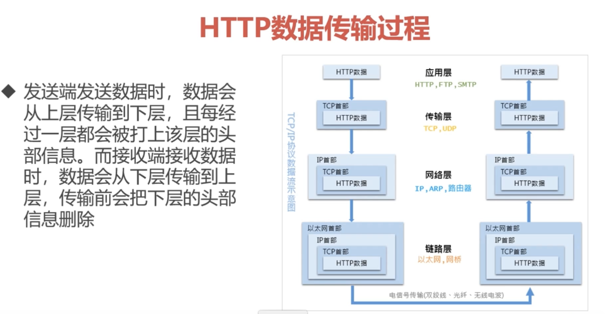
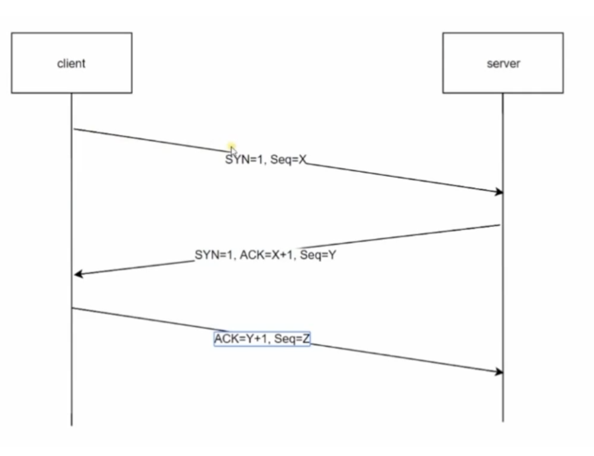
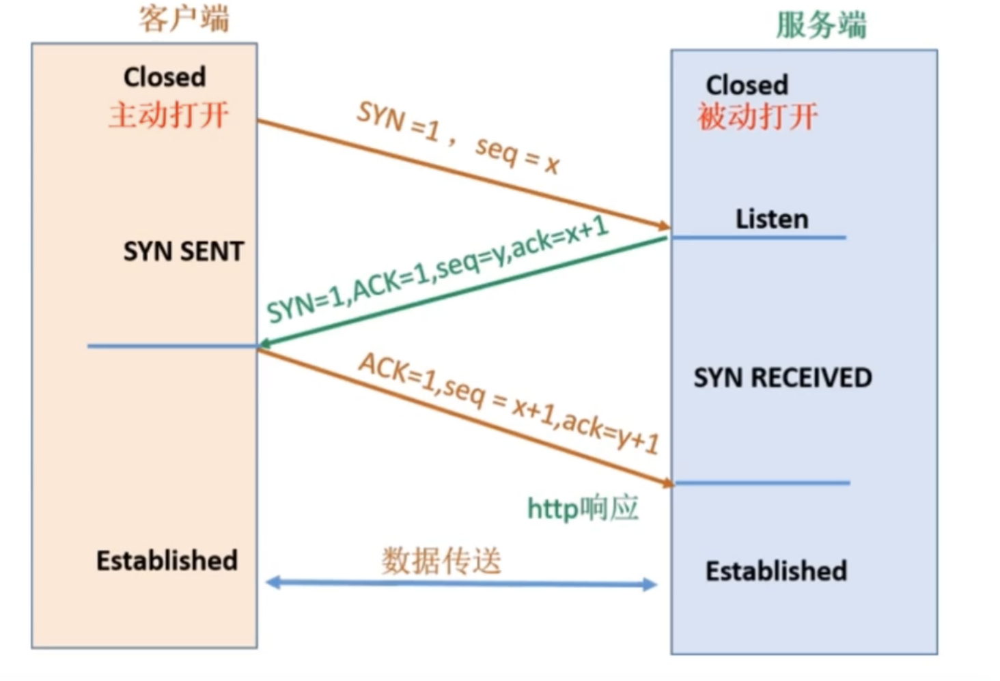

> HTTP 协议是构建在 TCP/IP 协议之上的，是 TCP/IP 协议的一个子集

- TCP/IP 协议族

  > 一系列与互联网相关的协议集合起来的总称
  > 分层管理是 TCP/IP 协议 的重要特征

- TCP/IP 协议族分层
  > TCP/IP 协议族由一个四层协议组成的系统：
  > `应用层` - 一般是我们编写的应用程序，决定了向用户提供的应用服务。应用层可以通过系统调用与传输层进行通讯。如，FTP DNS HTTP 等。
  > `传输层` - 通过系统调用向应用层提供处于网络连接中的两台计算机之间的数据传输功能。在传输层有两个性质不同的协议，TCP[面向连接的-效率低-可靠] UDP[无连接的-效率高-不可靠]。
  > `网络层` - 用来处理在网络上流动的数据包，数据包是网络传输的最小数据单位。该层规定了通过怎样的路径（传输路线）到达对方计算机，并把数据包传输给对方。
  > `数据链路层` - 用来处理连接网络的硬件部分，包括控制操作系统、硬件设备驱动、NIC（Network Interface Card，网络适配器）。硬件上的范畴均在链路层的作用范围之内。

- 传输层 TCP 三次握手
  > 使用 TCP 协议进行通信的双方必须先建立连接，然后才能开始传输数据。为了确保连接双方可靠性，在双方建立连接时，TCP 协议采用了三次握手策略。确保客户端与服务端的发送与接收能力都是正常的。

> 第一次客户端向服务端发送 SYN 报文段到服务端，服务端接收到了这个报文段，此时服务端就可以确认客户点的发送能力没有问题，然后服务端将 SYN + ACK 的报文段发送给客户端，客户端接收到了这个报文段，此时客户端就可以确认，服务端的接收与发送能力都没有问题，最后客户端再将 ACK 报文段发送给服务端，此时服务端确认客户端的接收能力也没有问题，经过三次握手之后就可以建立数据传送了。
