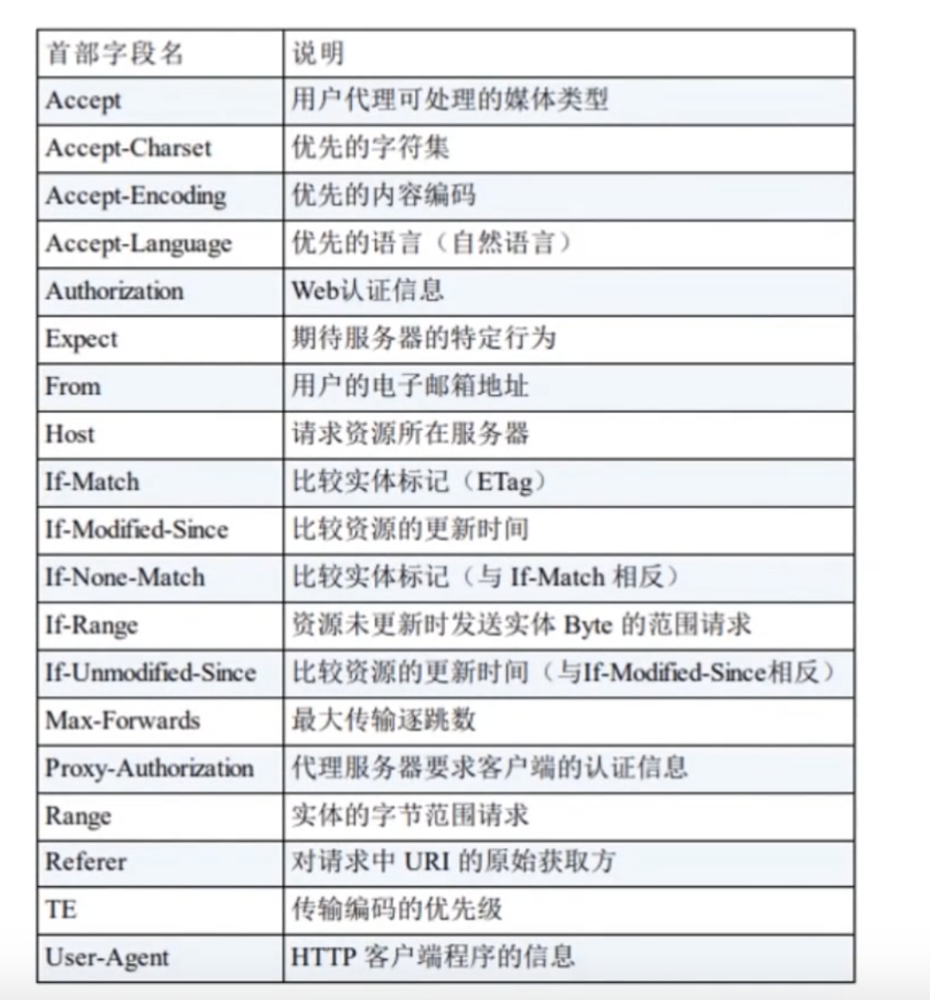

- 请求报文


- HTTP 报文头 [在 HTTP1.1 里一共规范了 47 种报文头字段]
  > `通用报文头`


> `请求报文头`



> `响应报文头`


> `实体报文头`


- 一些常用的报文头
  > Accept 「请求报文头」 - 告诉浏览器端可以接受的媒体类型

```js
Accept:text/html // 代表浏览器可以接受服务器回发的类型为 text/html 也就是我们常说的 HTML 文档，如果服务器无法返回 text/html类型的数据，服务器应该返回一个 406 错误 （Non Acceptable）
Accept:*/* // 代表浏览器可以处理所有类型

// 可以设置权重 q 。范围在 0 ~ 1 可精确到小数后三位，最大为 1 。不指定默认为 1。当服务器提供多种内容时，首先返回权重值最高的媒体类型。
```

> Accept-Encoding 「请求报文头」- 浏览器申明自己接受的编码方法，通常指定压缩方法，是否支持压缩，支持什么压缩方法（gzip,deflate）`Accept-Encoding:gzip,deflate`

> Accept-Language 「请求报文头」- 浏览器申明自己接收的语言 `Accept-Language:zh-cn,zh;q=0.7,en-us,en;q=0.3` 客户端在服务器没有中文版资源时，则请求返回英文版响应

> Connection 「通用文头」- `Connection:keep-alive` 当一个网页打开完成后，客户端和服务器之间用于传输 HTTP 数据的 TCP 连接不会关闭，如果客户端再次访问这个服务器上的网页，会继续使用这一条已经建立的连接。`Connection:close` 代表一个 Request 完成后，客户端和服务器之间用于传输 HTTP 数据的 TCP 连接会关闭，当客户端再次发送 Request ，需要重新建立 TCP 连接

> Host「请求报文头」- 主要用于指定被请求资源的 Internet 主机和端口号，它通常从 HTTP URL 中提取出来。

> Referer「请求报文头」- 当浏览器向 web 服务器发送请求的时候，一般会带上 Referer ,告诉服务器我是从哪个页面链接过来的，服务器借此可以获得一些信息用于处理

> User-Agent「请求报文头」- 告诉 HTTP 服务器，客户端使用的操作系统和浏览器的名称和版本

> Content-Type「实体报文头」- 说明了报文体内对象的媒体类型

```
text/html：html格式
text/plain：纯文本格式
text/xml：xml格式
image/gif：gif图片格式
image/jpeg：jpeg图片格式
image/png：png图片格式
application/xhtml_xml：XHTML 格式
application/xml：xml 格式
application/atom+xml：Atom XML 聚合格式
application/json：json 格式
application/pdf：PDF 格式
application/msword：Word 文档格式
application/octet-stream：二进制流数据（如常见的文件下载）
application/x-www-form-urlencoded：表单提交
```

- 响应报文


