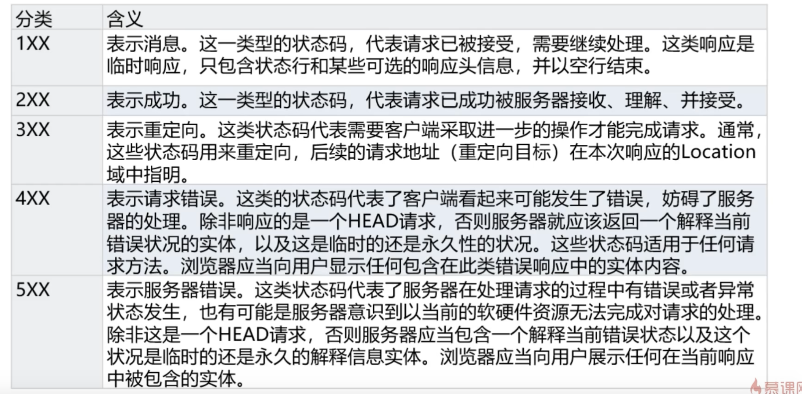

> 用来表示网页服务器超文本传输协议响应状态的 3 位数字代码

- 1xx

- 2xx

  > 200 请求成功
  > 202 已接受 但未处理完成
  > 204 务器成功处理了请求，但没返回任何内容
  > 206 部分内容 服务器成功处理了部分 GET 请求

- 3xx

  > 301 永久移动
  > 302 临时移动
  > 304 未修改

- 4xx

  > 400 请求参数有误
  > 401 未授权 用户验证
  > 403 服务器理解但是拒绝此请求
  > 404 未找到

- 5xx
  > 500 服务器端错误
  > 502 网关代理服务器错误
