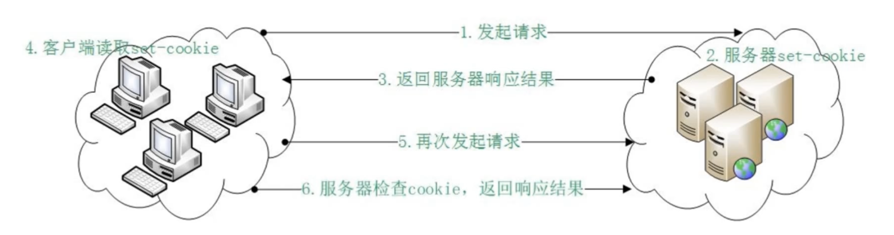
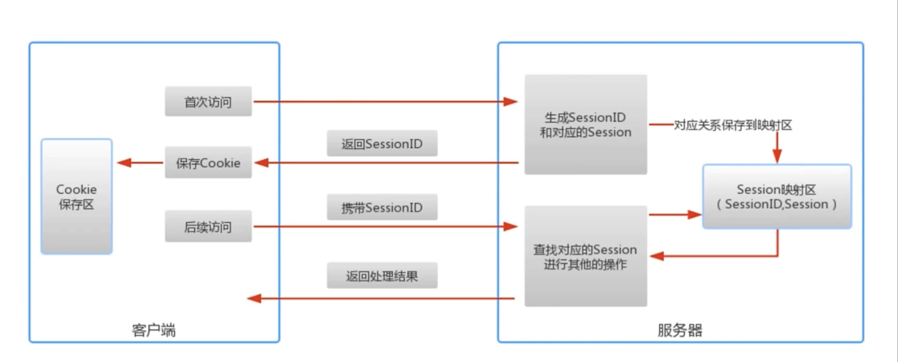

- http 状态管理 [会话机制]

- cookie

  > 是一小段文本信息。客户端请求服务器，如果服务器需要记录用户状态，就像客户端浏览器颁发一个 cookie。客户端浏览器会把 cookie 保存起来。当浏览器再请求该网站时，浏览器吧请求的网址连同该 cookie 一同提交给服务器。服务器检查该 cookie ，以此来辨认用户状态。

  

- session

  > 另一种记录客户状态的机智，保存在服务器上。客户端浏览器访问服务器的时候，服务器吧客户端信息以某种形式记录在服务器上，哭护短浏览器再次访问时只需要从该 session 中查找该客户的状态就可以了

  

  > session 超时失效

  - cookie 与 session 区别
    > cookie 存放于客户端 session 存放于服务端
    > cookie 可以保存很长时间 session 不行
