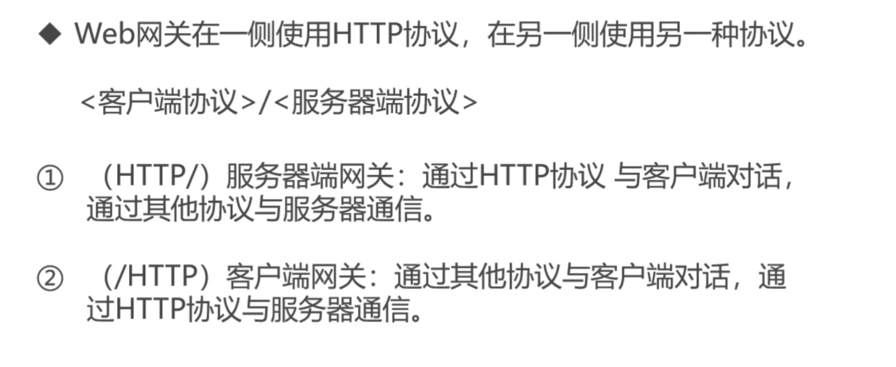

> 网关可以作为某种翻译器使用，它抽象出了一种能够到达资源的方法。网关是资源和应用程序之间的粘合剂。网关扮演的是 '协议转换器' 的角色。

> Web 网关再一侧使用 HTTP 协议，在另一侧使用另一种协议。

- 常见网关类型
  > HTTP/\* 服务器端 Web 网关
  > HTTP/HTTPS 服务器端安全网关
  > HTTPS/HTTP 客户端安全加速器网关
  > 资源网关
