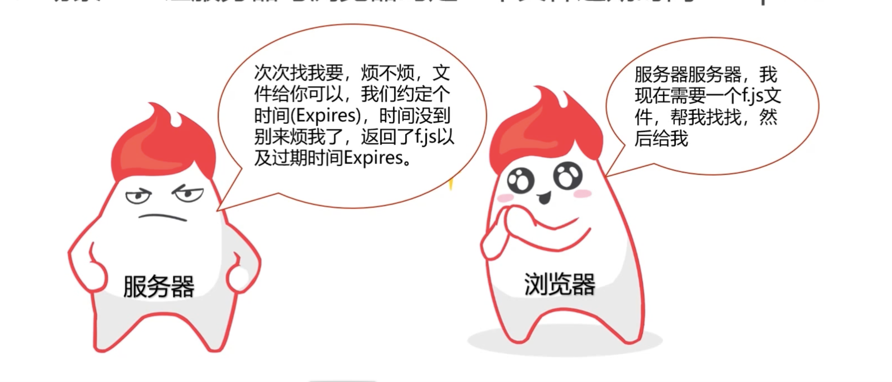
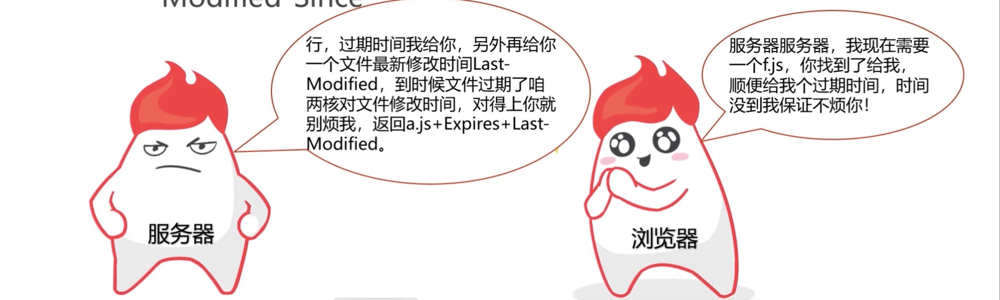
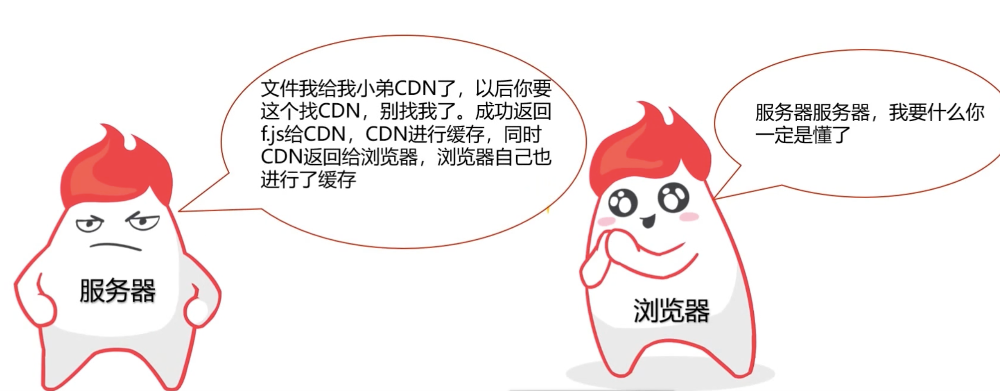
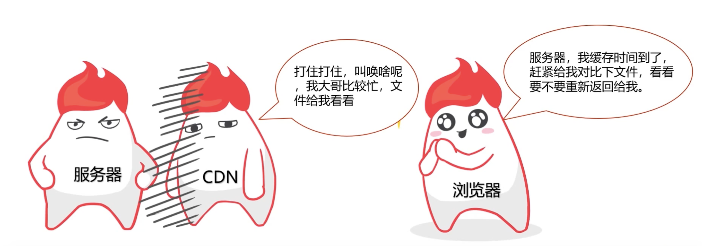
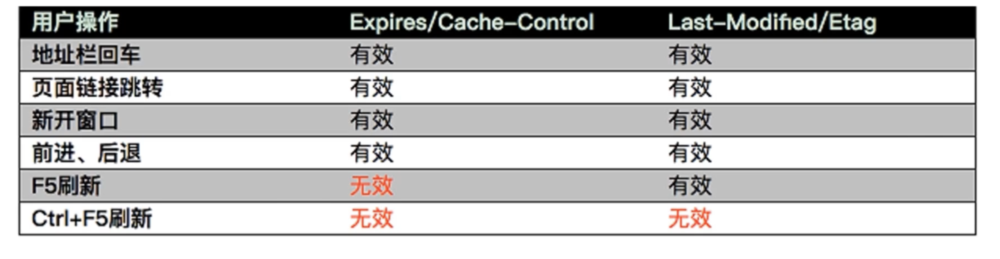

- 为什么要使用 HTTP 缓存？

* 缓存的内容又是什么？

- HTTP 缓存头部字段

  > Cache-Control - 请求/响应头，缓存控制字段：
  > no-store - 所有内容都不缓存
  > no-cache - 缓存，但是浏览器使用缓存前，都会请求服务器判断缓存资源是否是最新的
  > max-age = x(单位秒) - 请求缓存后的 x 秒不再发起请求
  > s-maxage= x (单位秒) - 代理服务器请求源站缓存后的 x 秒不再发起请求，只对 CDN 缓存有效
  > public - 客户端和代理服务器（CND）都可缓存
  > private 只有客户端可以缓存

  > Expires - 响应头，代表资源过期时间，由服务器返回提供，是 HTTP1.0 的属性，在与 max-age 共存的情况下，优先级要低。

  > Last-Modified - 响应头，资源最新修改时间，由服务器告诉浏览器

  > if-Modified_Since - 请求头，资源最新修改时间，由浏览器告诉服务器，和 Last-Modified 是一对，他俩会进行对比

  > Etag - 响应头，资源标识，由服务器告诉浏览器

  > if-None-Match - 请求头，缓存资源标识，由浏览器告诉服务器（其实就是上次服务器给的 Etag），和 Etag 是一对，他俩会进行对比

* HTTP 缓存的工作方式

> 场景一：让服务器与浏览器约定一个文件过期事件 —— Expires

> 场景二：让服务器与浏览器在约定文件过期时间的基础上，再加一个文件最新时间的对比 —— Last-Modified 与 Modified-Since
> 

> 场景一 + 场景二 ： 客户端第一次向服务端发送请求，服务端返回响应请求以及过期时间 Expires + Last-Modified 给客户端，在过期时间内直接使用缓存，如果超过过期时间，则对比 if-Modified-Since 与 Last-Modified 如果两个值相等服务器返回 304 继续使用本地缓存，不相等则服务器查找资源并重新返回 Expires + Last-Modified + 对应资源

> 场景三：让服务器与浏览器在 Expires + Last-Modified 的基础上，增加一个文件内容唯一对比标记 Etag 与 if-None-Match。 Expires 不稳定，再加一个 max-age 来加以代替。mag-age 要比 Expires 的优先级高就可以不再使用 Expires。然后浏览器再次发送请求，如果在 max-age 时间内就使用本地缓存，超过这个事件对比 if-None-Match 与 Etag 这两个值比 if-Modified-Since 与 Last-Modified 的优先级高，就不对比 if-Modified-Since 与 Last-Modified 的值了，所以当 if-None-Match 与 Etag 如果两个值相等服务器返回 304 继续使用本地缓存，不相等则服务器查找资源并重新返回 Expires + Last-Modified + 对应资源

> 以上三个场景的缺陷在于，如果 Expires 或者 max-age 没有过期则浏览器无法主动感知文件的变化

> 改进方案：
> md5/hash 缓存 [可以借助 webpack 实现]：
> 通过不缓存 HTML ，为静态文件添加 MD5 或者 hash 标识，解决浏览器无法跳过缓存过期时间主动感知文件变化问题。
> CDN 缓存：
> CDN 是构建在网络智商的内容分发网络，依靠不糊在各地的边缘服务器，通过中心平台的负载均衡、内容分发、调度等功能模块，使用户就近获取所需内容，降低网络拥塞，提高用户访问响应速度和命中率。
> CDN 的工作方式：
> 第一次请求

> 后续缓存

- 浏览器操作对缓存的影响

