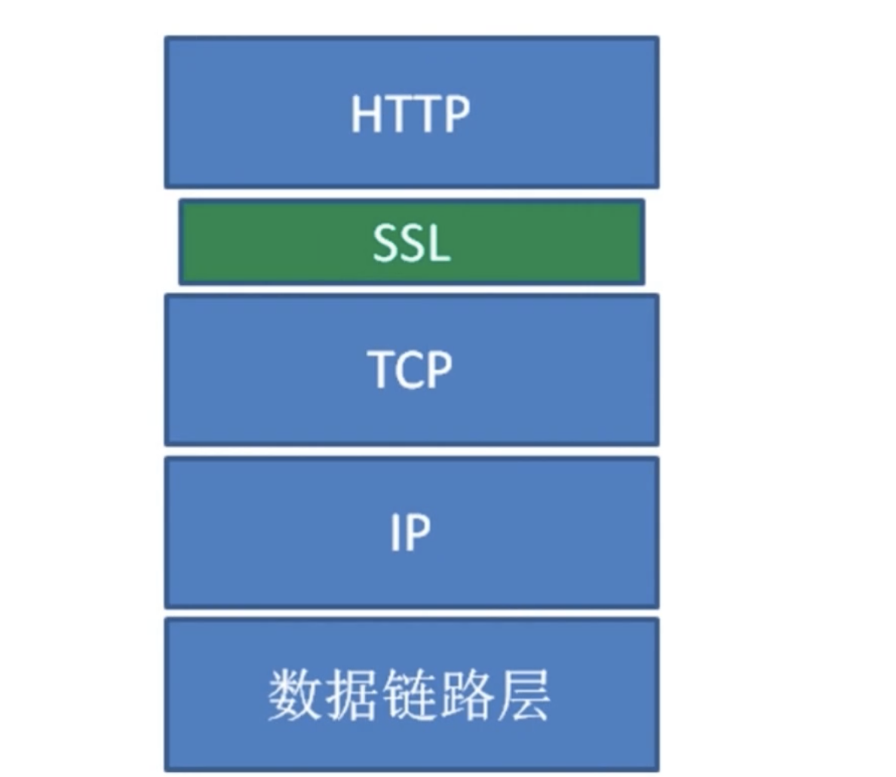
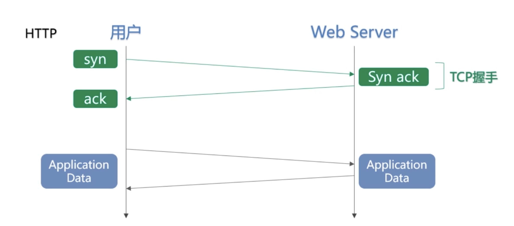
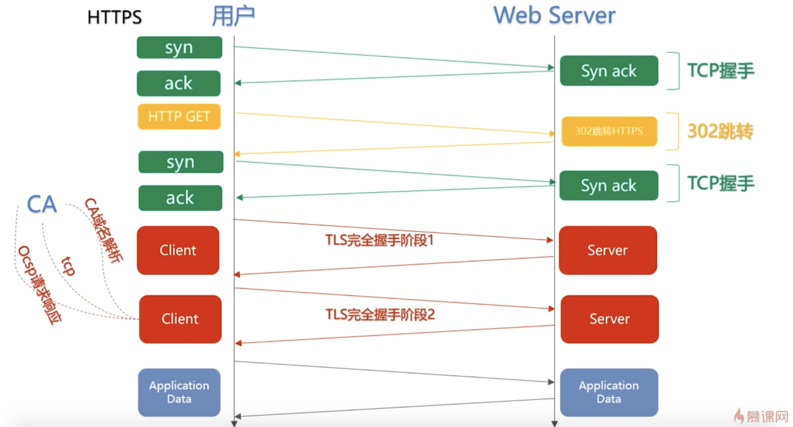

> HTTPS 增加了加密层
> HTTPS 可以认为 HTTP + TLS
> TLS 是传输层加密协议，他的前身是 SSL 协议

- 内容加密

  > 非堆成密钥交换
  > 对称内容加密

- 身份认证 - 证书

  > 数字证书

- 数据完整性

- HTTPS 使用成本

  > 证书的费用以及更新维护
  > HTTPS 降低用户的访问速度
  > 消耗 CPU 资源，需要增加大量机器

- HTTPS 对性能的影响

  > 协议交互所增加的 RTT（往返迟延）
  > 加解密相关耗时[浏览器计算耗时 服务端计算耗时]

