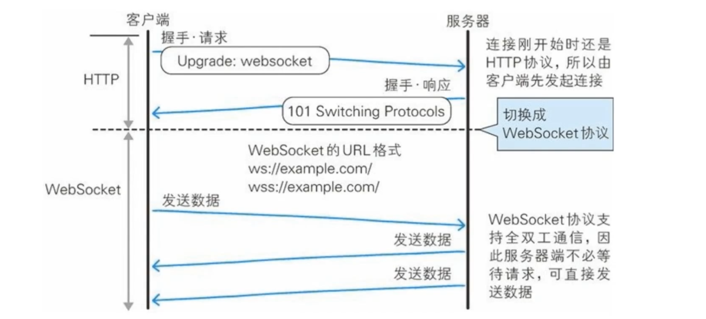
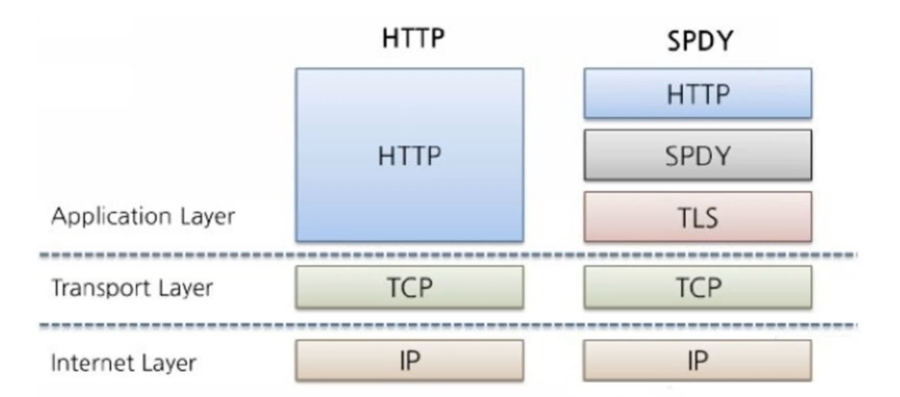
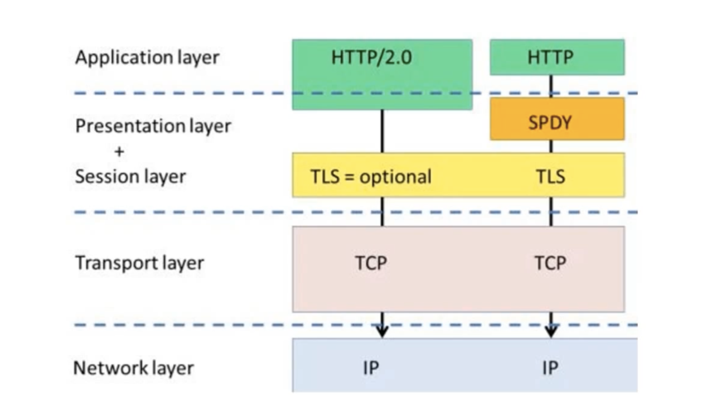
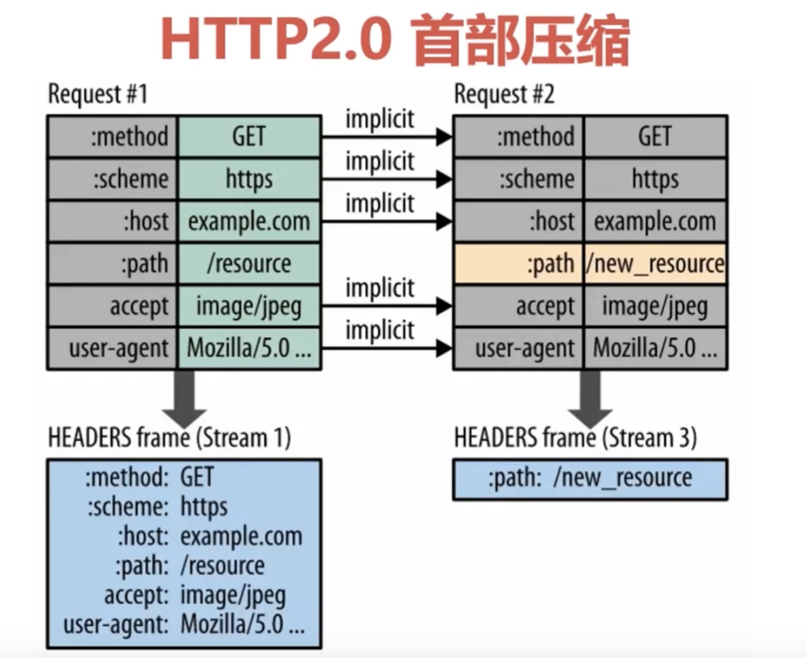
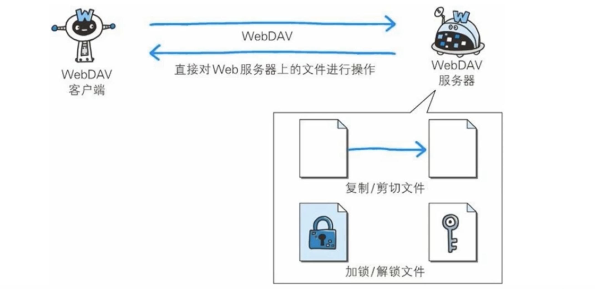
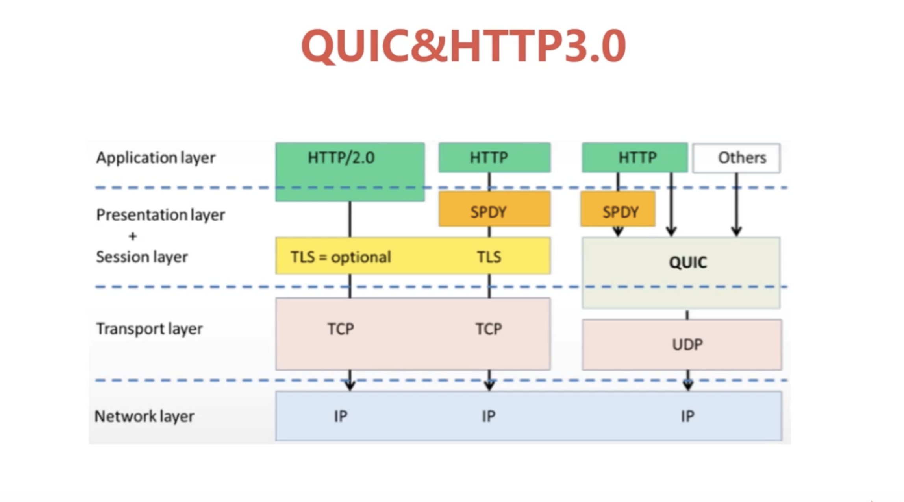

- 影响 HTTP 网络请求的因素

  > 带宽
  > 延迟：
  > 浏览器的阻塞，一条连接只可发送一个请求
  > 请求只能从客户端开始，客户端不可以接受除响应以外的指令
  > 请求/响应头不经压缩就发送
  > 每次互相发送相同的头部造成的浪费
  > 非强制压缩发送

- Websocket

  > 持久化的协议
  > 服务器可以主动推送给客户端
  > 特点：真正的全双工方式；减少通信量；

  

> ajax 轮询 每隔几秒就向服务器发送请求看有没有新的数据
> 长轮询 - 发送请求 一直等着 有消息才返回 然后再继续请求

- SPDY [对于 HTTP 的增强]

  > 多路复用 请求优化
  > 支持服务器推送技术
  > 压缩了 HTTP 头
  > 强制使用 SSL 传输协议

  > 意义：网页速度变快，增加安全性

- HTTP2.0

  > 性能增强的核心：二进制分帧技术 - 将所有传输信息分成更小的帧并用二进制编码

  > 多路复用：多路复用允许同时通过单一的 HTTP/2 连接发起多重的请求-响应消息

  > 单链接多资源的优势：
  > 可以减少服务链接压力，内存占用少了，连接吞吐量大了
  > TCP 连接减少是网络拥塞状况改观
  > 启动时间减少，拥塞和丢包恢复速度更快

  > 并行双向字节流的请求和响应:
  > 并行交错的发送请求，请求之间互不影响
  > 并行交错的发送响应，响应之间互不干扰
  > 只使用一个连接即可并行发送多个请求和响应
  > 消除不必要的延迟，减少页面加载时间

  > 请求优先级：
  > 高优先级的流都应该优先发送
  > 优选级不是绝对的
  > 不同优先级混合也是必须的

  > 服务器推送

- WebDAV 协议
  

- HTTP3.0

  > HTTP2.0 问题：队头阻塞；建立连接的握手延迟大

  > QUIC 特点：
  > 0 RTT
  > 没有队头阻塞的多路复用
  > 基于 UDP

