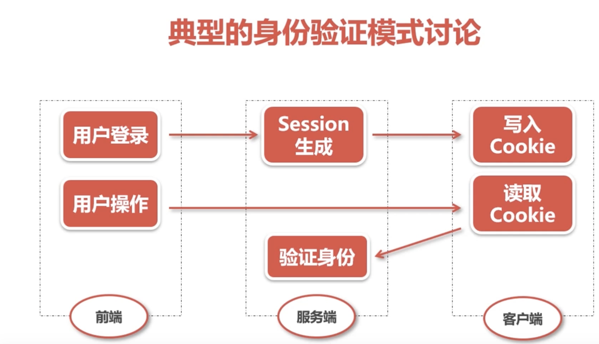

- 验证机制安全

  > 登陆 验证等
  > 应用程序防御恶意攻击的核心机制
  > 处于安全防御最前沿，如果被用户轻易突破，通常应用程序的全部功能数据都会被其控制
  > 缺乏安全有效的验证机制，其他核心安全机制都无法实施

  

  > 验证技术：
  > 基于 HTM 表单的验证
  > 多元机制，如组合型密码
  > 客户端 ssl 证书

  > 验证机制漏洞：
  > 弱密码 - 很短、空白 ...
  > 弱密码容易被暴力破解

  > 暴力破解-安全措施：
  > 验证码技术 - 验证码是否真实有效；验证码复杂度
  > cookie 和会话检测 - 计数验证
  > 双因子验证 - 个人密码 和 手机（验证码） 双重验证

* 会话管理机制

  > 在执行登陆时显得特别重要，因为，它可在用户通过请求提交他们的证书后，持续向应用程序保证任何特定用户身份的真实性

  > 会话令牌生成漏洞:
  > 一些会话令牌通过用户的用户名或电子邮件地址转换而来，或者使用与其相关的其他信息创建，这些信息可以某种方式进行编码或模糊处理，也可与其他数据结合在一起
  > 令牌可预测
  > 事件依赖

  > 会话终止攻击

  > 防御：
  > 传输安全 使用 HTTPS
  > 增加软硬会话过期
  > 提供完善的注销功能

* SQL 注入攻击

  > SQL 注入危害：探知数据库；泄漏数据；取得更高权限

  > 防御:
  > 参数化查询

* 跨站脚本攻击

  > 通常通过注入 HTML 或 js 等脚本发动攻击，公司成功后攻击者可以得到私密网页内容和 cookie

  > 危害：
  > 盗取各类用户账号
  > 控制数据
  > 盗取资料
  > 非法转账
  > 强制发送网站挂马
  > 控制受害者机器向其他网站发起攻击

  > 反射式 XSS ：
  > 也称为非永久性 XSS，是目前最流行的 XSS 攻击
  > 他出现在服务器直接使用客户端提交的数据，如 url 的数据、HTML 表单中提交数据等，并且没有对数据进行无害化处理
  > 如果提交的数据中含有 HTML 控制字符而没有被正确处理，那么一个简单的 XSS 攻击就会发生
  > 典型的反射式攻击可通过一个邮件或中间网站，有二十一个看起来可信任的站点的连接，其中包含 XSS 攻击脚本
  > 如果信任的网站没有正确处理这个脚本，用户点击后就会导致浏览器执行含有恶意攻击的脚本

  > 存储式 XSS：
  > 也称为永久性 XSS，危害更大。攻击者将攻击脚本上传到 Web 服务器上，使得所有访问该页面的用户都面临信息泄露的可能，其中也包括了 Web 服务器的管理员。
  > 多发生在最终显示给其他用户的位置包含：个人信息字段，地址电子邮箱等；文档上传文件及其他数据的名称；反馈投诉等位置

  > 基于 DOM 的 XSS 攻击：反射式 XSS 攻击和存储式 XSS 攻击都是通过服务器端提取用户提交的数据。并且以不安全你的方式将其返回给用户。
  > 基于 DOM 的攻击仅仅通过 js 的方式执行

  > XSS 攻击载荷：
  > 会话令牌
  > 虚拟置换
  > 注入木马

  > XSS 防御措施：
  > 输入验证
  > 输出编码

* CSRF[跨站请求伪造] 攻击

  > 浏览器会自动的发送标识用户对话的信息，无须用户干预。

  > 预防：
  > 增加确认操作
  > 重新认证
  > 使用 token
