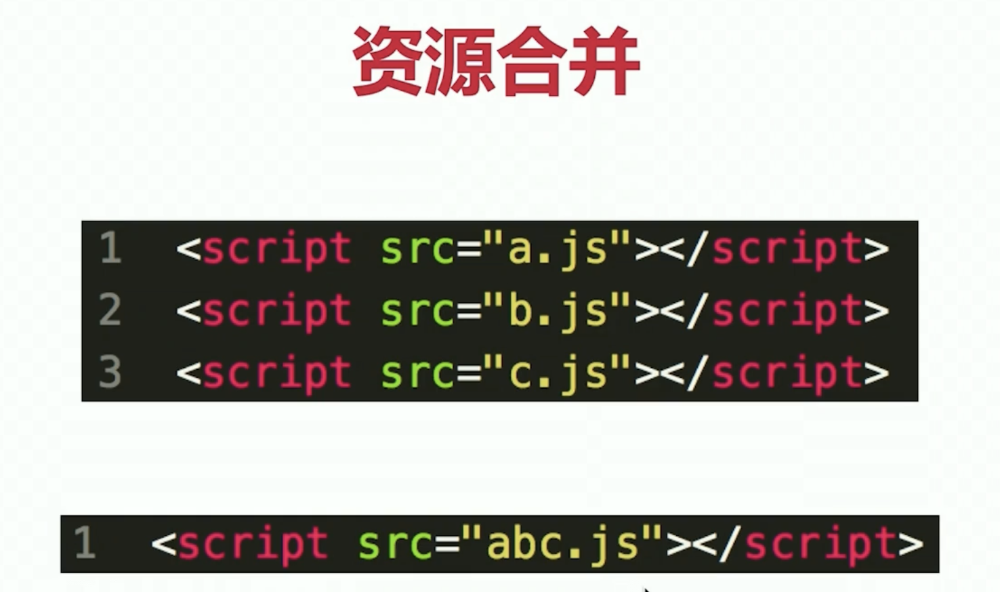
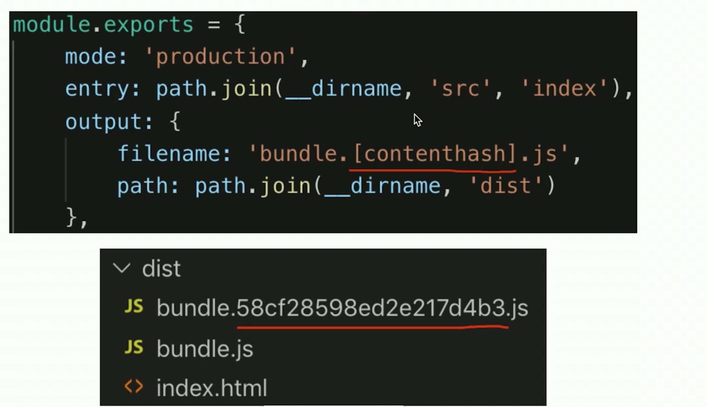
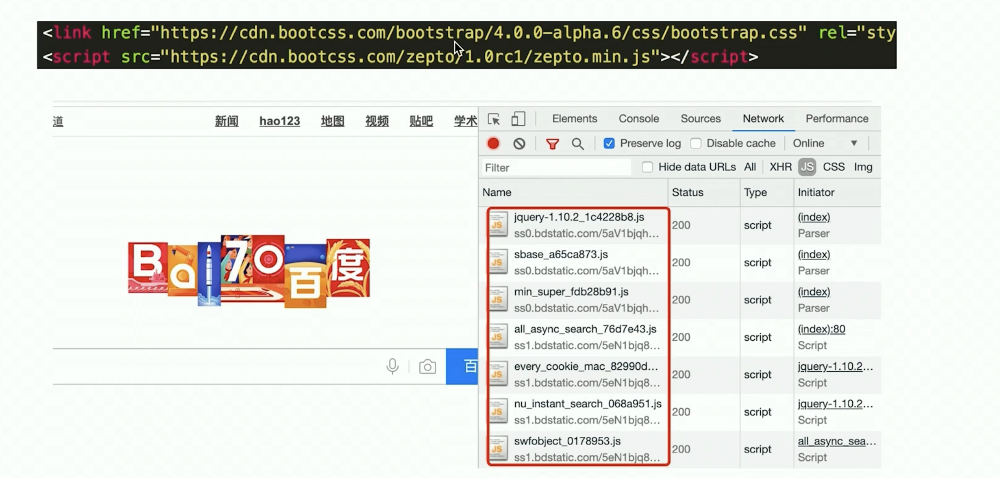
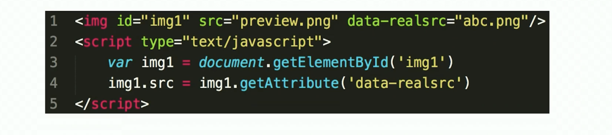
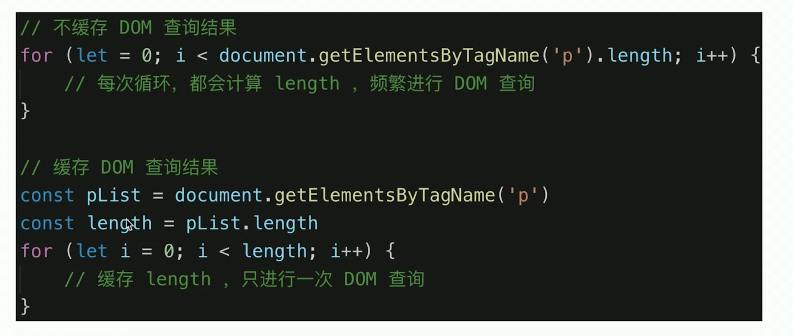
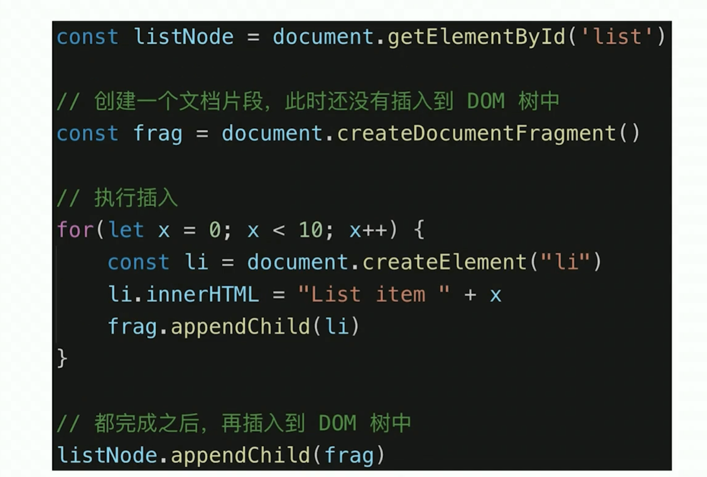
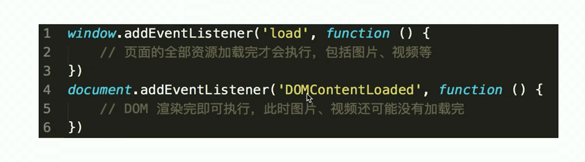

- 性能优化的原则

  > 多使用内存、缓存或其他方法
  > 减少 CPU 计算量，减少网络加载耗时

- 从何入手

  > 让加载更快
  > 让渲染更快

- 让加载更快
  > 减少资源体积：压缩代码
  > 减少访问次数：合并代码，SSR 服务端渲染，缓存
  > 使用更快的网络：CDN




> 缓存 : url 和文件不变，则会自动触发 HTTP 缓存机制，返回 304



> SSR：将网页和数据一起加载，一起渲染
> 非 SSR(前后端分离)：先加载网页，再加载数据，在渲染数据







- 让渲染更快

  > CSS 放在 head ， JS 放在 body 最下边
  > 尽早开始执行 JS ，用 DOMContentLoaded 触发
  > 懒加载（图片懒加载，赏花加载更多）
  > 对 DOM 查询进行缓存
  > 频繁 DOM 操作，合并到一起插入 DOM 结构
  > 节流 throttle 防抖 debounce

- 防抖 debounce
  > 场景：监听一个输入框，文字变化后出发 change 事件，直接用 keyup 事件会频繁出发 change 事件，防抖就是用户输入结束或暂停时，才会出发 change 事件

```js
let timer = null;
input.addEventListen('keyup', function () {
  if (timer) {
    clearTimeout(timer);
  }
  timer = setTimeout(() => {
    // 触发change事件
    console.log(666)
    // 清空定时器
    timer = null
  });
}，500);

/* 封装一下 */
// 防抖
function debounce(fn, delay = 500) {
    // timer 是闭包中的
    let timer = null

    return function () {
        if (timer) {
            clearTimeout(timer)
        }
        timer = setTimeout(() => {
            fn.apply(this, arguments)
            timer = null
        }, delay)
    }
}

// 使用
input1.addEventListener('keyup', debounce(function (e) {
    console.log(e.target)
    console.log(input1.value)
}, 600))


```

- 节流 throttle
  > 使用场景：拖拽一个元素时，要随时拿到该元素被拖拽的位置，直接用 drag 事件，则会频发触发，很容易导致卡顿，节流则是无论拖拽速度多快，都会每隔 100ms 触发一次

```js
let timer = null;
div.addEventListener('drag', function (e) {
  if (timer) {
    return;
  }
  timer = setTimeout(() => {
    console.log(e.offsetX, e.offsetY);
    timer = null;
  }, 100);
});

/* 封装一下 */
// 节流
function throttle(fn, delay = 100) {
  let timer = null;

  return function () {
    if (timer) {
      return;
    }
    timer = setTimeout(() => {
      fn.apply(this, arguments);
      timer = null;
    }, delay);
  };
}

div1.addEventListener(
  'drag',
  throttle(function (e) {
    console.log(e.offsetX, e.offsetY);
  })
);

div1.addEventListener('drag', function (event) {});
```
