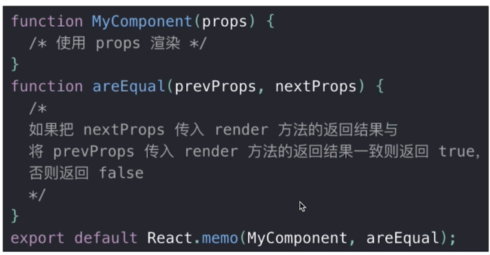
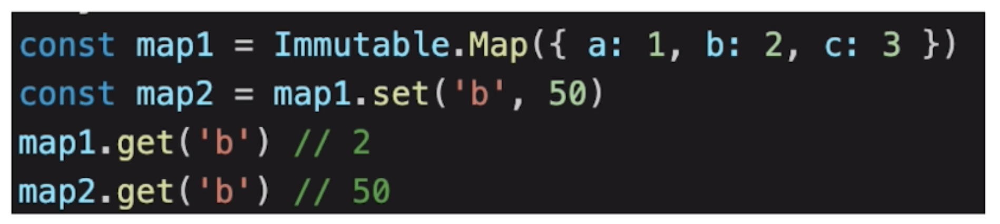
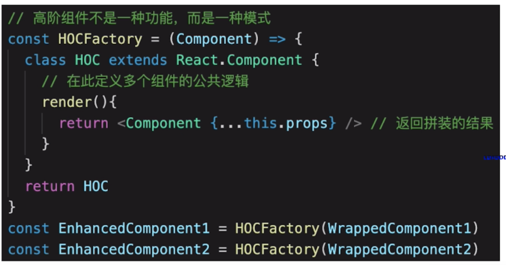
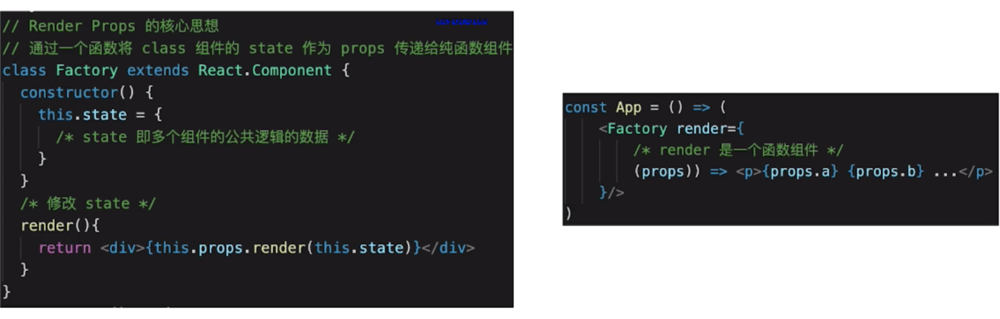

- 函数组件

  > 更符合 React 的理念，纯函数的理念，通过设定一个值去渲染一个结果。
  > 与 class 组件的区别： 纯函数，输入 props，输出 JSX。没有实例，没有生命周期，没有 state。不能扩展其他方法。

- 非受控组件 - 不受 state 控制

  > ref：this.inputRef = React.createRef() <Input ref = {this.inputRef}> this.inputRef.current
  > defalultValue defaultChecked
  > 使用场景：文件必须手动操作 DOM 元素 ，setState 实现不了，如，文件上传 <input type='file'> ；某些富文本编辑器，需要传入 DOM 元素
  > 受控组件 vs 非受控组件：优先使用受控组件，必须操作 DOM 使用非受控组件

- Portals

  > 组件默认会按照既定层次嵌套渲染
  > 如何让组件渲染到父组件以外？

```javascript
 render() {
        // // 正常渲染
        // return <div className="modal">
        //     {this.props.children} {/* vue slot */}
        // </div>

        // 使用 Portals 渲染到 body 上。
        // fixed 元素要放在 body 上，有更好的浏览器兼容性。
        return ReactDOM.createPortal(
            <div className="modal">{this.props.children}</div>,
            document.body // 要放到哪个 DOM 节点上
        )
    }
```

> 使用场景：
> 父组件：overflow: hidden / 父组件 z-index 太小 / fixed 需要放在 body 第一层级

- context

  > 公共信息（语言、主题）如何传递给每个组件？用 props 太繁琐、用 redux 小题大做

```js
/* 定义 */

// 创建 Context 填入默认值（任何一个 js 变量）
const ThemeContext = React.createContext('light');

class App extends React.Component {
  constructor(props) {
    super(props);
    this.state = {
      theme: 'light',
    };
  }
  render() {
    return (
      <ThemeContext.Provider value={this.state.theme}>
        <Toolbar />
        <hr />
        <button onClick={this.changeTheme}>change theme</button>
      </ThemeContext.Provider>
    );
  }
  changeTheme = () => {
    this.setState({
      theme: this.state.theme === 'light' ? 'dark' : 'light',
    });
  };
}

/* 使用 - class 组件 */
// 底层组件 - class 组件
class ThemedButton extends React.Component {
  // 指定 contextType 读取当前的 theme context。
  // static contextType = ThemeContext // 也可以用 ThemedButton.contextType = ThemeContext
  render() {
    const theme = this.context; // React 会往上找到最近的 theme Provider，然后使用它的值。
    return (
      <div>
        <p>button's theme is {theme}</p>
      </div>
    );
  }
}
ThemedButton.contextType = ThemeContext; // 指定 contextType 读取当前的 theme context。

/* 使用 - 函数式组件 */
// 底层组件 - 函数是组件
function ThemeLink(props) {
  // const theme = this.context // 会报错。函数式组件没有实例，即没有 this

  // 函数式组件可以使用 Consumer
  return <ThemeContext.Consumer>{(value) => <p>link's theme is {value}</p>}</ThemeContext.Consumer>;
}
```

- 异步组件

  > import()
  > React.lazy
  > React.Suspense

```js
import React from 'react';

const ContextDemo = React.lazy(() => import('./ContextDemo'));

class App extends React.Component {
  constructor(props) {
    super(props);
  }
  render() {
    return (
      <div>
        <p>引入一个动态组件</p>
        <hr />
        <React.Suspense fallback={<div>Loading...</div>}>
          <ContextDemo />
        </React.Suspense>
      </div>
    );

    // 1. 强制刷新，可看到 loading （看不到就限制一下 chrome 网速）
    // 2. 看 network 的 js 加载
  }
}

export default App;
```

- 性能优化

> 性能对 React 更加重要，永远是面试的重点
> React 默认 父组件有更新，子组件则无条件也更新 `「这是使用 SCU 的本质原因」`

> shouldComponentUpdate：
> SCU 默认返回 true，即默认重新渲染所有子组件
> React 默认 父组件有更新，子组件则无条件也更新 `「这是使用 SCU 的本质原因」` 可以使用 SCU 阻止不必要的重复渲染
> 必须配合不可变值来使用，否则会出现 bug 无法使用。
> 有性能问题时再考虑使用

> PureComponent 和 React.memo：
> pureComponent , SCU 中实现了浅比较
> memo ，函数组件中的 PureComponent
> 浅比较已适用大部分情况



> 不可变值 immutable.js：
> 彻底拥有“不可变值”
> 基于共享数据（不是深拷贝），速度好



```Javascript
// shouldComputedUpdate 基本用法
shouldComponentUpdate(nextProps,nextState) {
  if (nextState.count !== this.state.count) {
    return true // 可以渲染
  }
  return false // 阻止渲染
}

```

- 关于组件公共逻辑的抽离
  > mixin 已经启用

> 高阶组件 HOC:
> 最后返回的是通过函数拼装的高阶组件



> Render Props:
> 

> HOC 与 Render Props 对比：
> HOC 模式简单，但会增加组件层级
> Render Props 代码简介，学习成本较高
