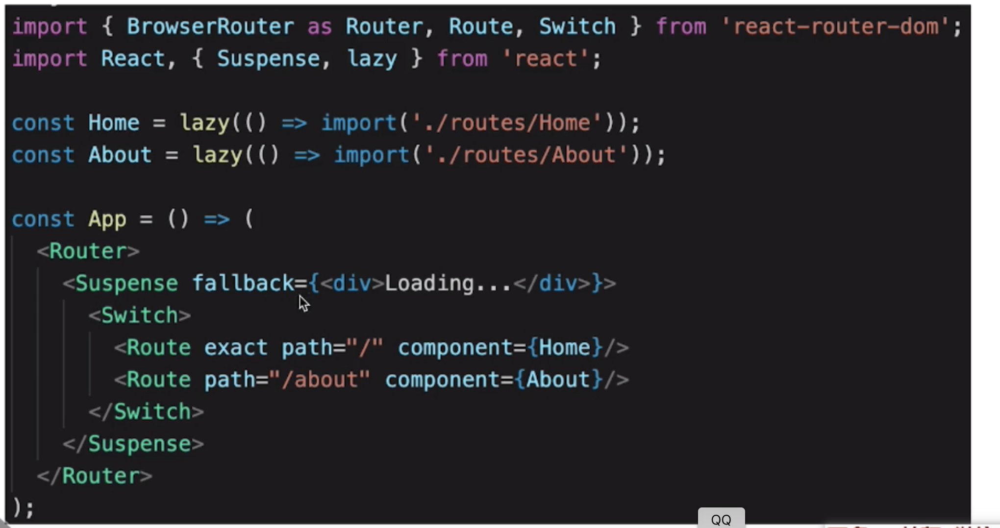

- 基本概念

  > store state
  > action
  > reducer

- 单项数据流

  > dispatch(action) -> reducer -> newState -> subscribe 触发通知

- react-redux

  > <Provider> connect
  > connect
  > mapStateToProps mapDispatchToProps

- 异步 action

- 中间件
  

- React-Router
  > 路由模式: hash、 H5 history

