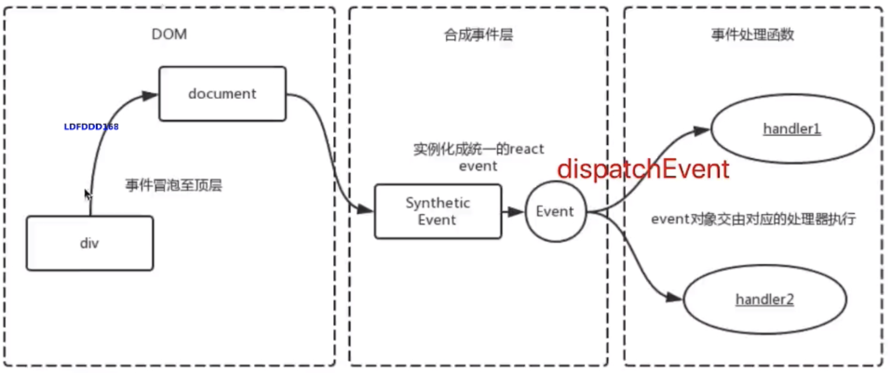
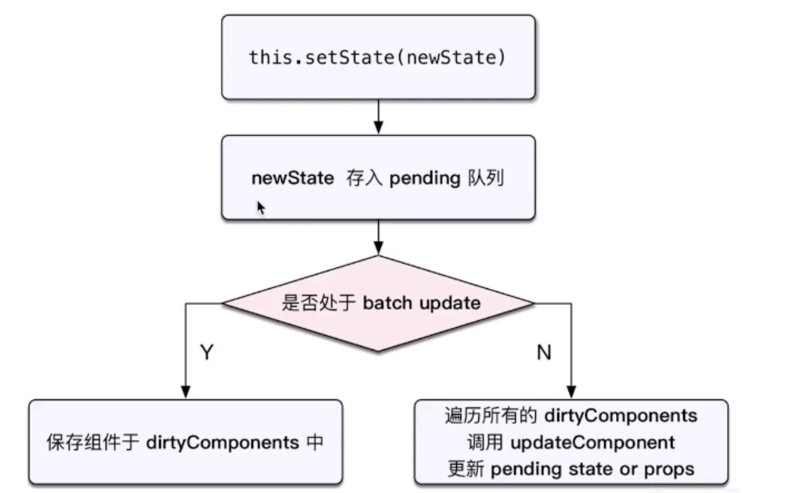
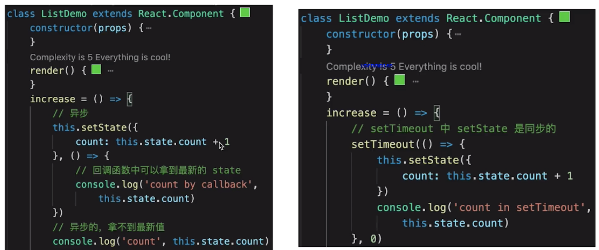
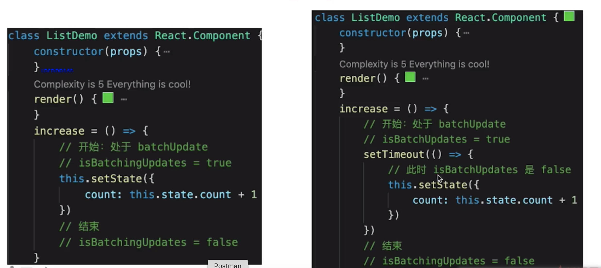
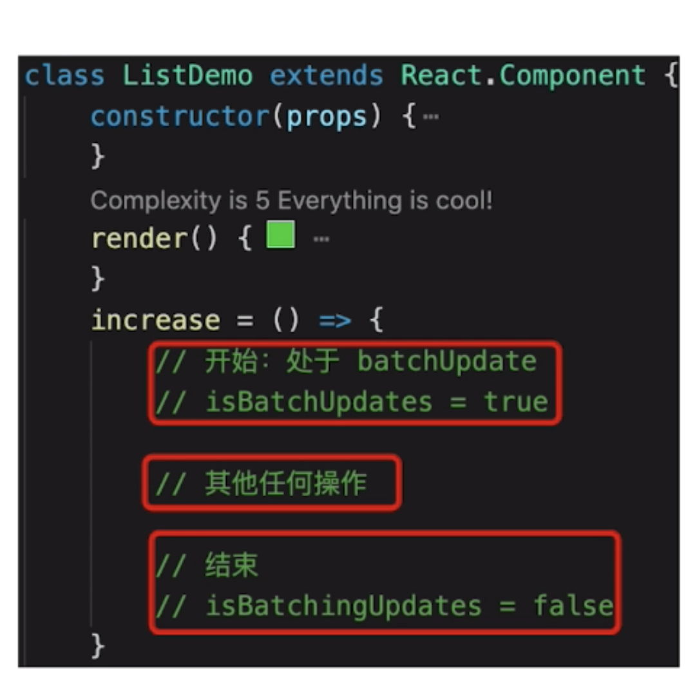
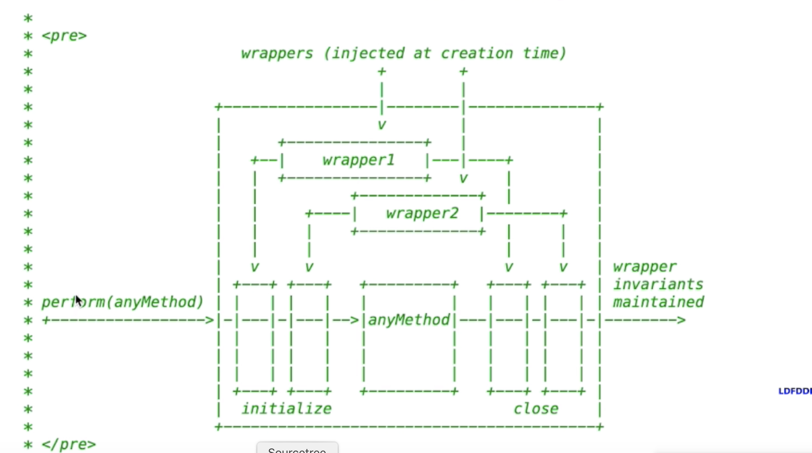
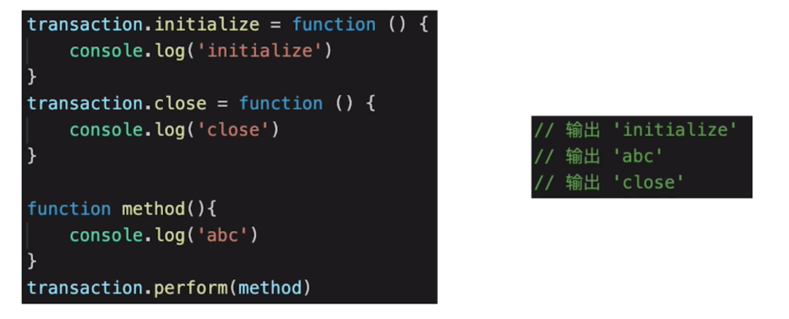

- 函数式编程

  > 一种编程范式
  > 纯函数
  > 不可变值

- vdom 和 diff

  > h 函数
  > vnode 数据结构
  > patch 函数
  > 只比较同一层级，不跨级比较
  > tag 不相同，则直接删掉重建，不再深度比较
  > tag 和 key ，两者都相同，则认为是相同节点，不再深度比较

  > vue2.x Vue3.0 React 三者 vdom 细节不同

* JSX 本质

  > React.createElement(tag,props,child)

* 合成事件

  > 所有时间挂载到 document 上
  > event 不是原生的，是 SyntheticEvent 合成时间对象
  > 和 Vue 事件不同，和 DOM 事件不同

  

  > 为什么要合成事件机制：
  > 更好的兼容性和跨平台
  > 挂载到 document ，减少内存消耗，避免频繁解绑
  > 方便事件的统一管理（如事务机制）

* setState batchUpdate

  > setState: setState 无所谓异步还是同步，看是否命中 batchUpdate 机制，判断 isBatchingUpdates 是 true 还是 false

  
  

  
  

  > 哪些能命中 batchUpdate 机制：
  > 生命周期（和它调用的函数）
  > React 中注册的事件（和它调用的函数）
  > React 可以管理的入口

  > transaction 事务机制：

  
  
  

- 组件渲染过程

  > JSX 如何渲染为页面
  > setState 之后如何更新页面
  > 面试考察全流程

  > 渲染过程： props state -> render 生成 vnode -> patch()
  > 更新过程： setState(newState) -> render() 生成 newVnode -> patch()

  > 更新的两个阶段，上述的 patch 被拆分为两个阶段：
  > reconciliation 阶段 - 执行 diff 算法，纯 JS 计算
  > commit 阶段 - 将 diff 结果渲染到 DOM 上

  > 可能遇到的性能问题：
  > JS 是单线程，且和 DOM 渲染共用一个线程
  > 当组件足够复杂，组件更新时计算和渲染都压力大
  > 同时再有 DOM 操作需求（动画，鼠标拖拽等），将卡顿
  > 解决方案：fiber
  > 将 reconciliation 阶段进行任务拆分（commit 无法拆分）
  > DOM 需要渲染时暂停，空闲时恢复
  > 依赖 window.requestIdleCallback 这个 API

  - 关于 fiber
  > React 内部运行机制，开发者体会不到
