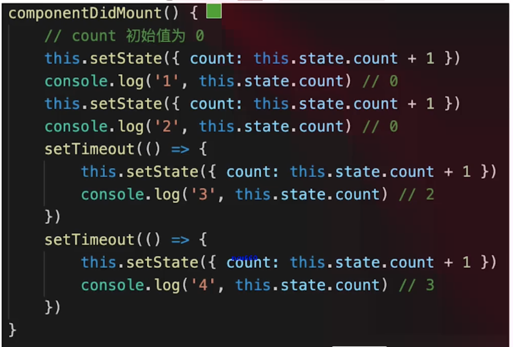
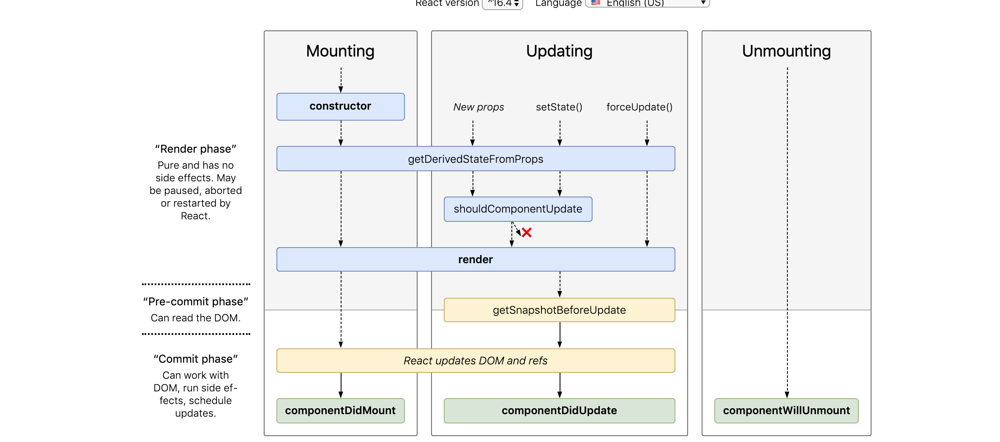

- 组件之间如何通讯

  > props redux context

- JSX 本质

  > createElement 执行返回 vnode

- context 是什么，如何应用

  > 父组件向其下所有子孙组件传递信息，如简单的公共信息，主题色，语言等

- shouldComponentUpdate 用途

  > 性能优化
  > 配合不可变值一起使用，否则会出错

- redux 单项数据流

  > view -> action -> dispatch -> reducer -> state -> view

- setState 场景题



- 什么是纯函数

> 返回一个新值，没有副作用（不会修改其他值）
> 重点：不可变值

- React 组件生命周期
  > 单组件生命周期：
  > 挂载时：construct render ComponentDidMount
  > 更新时：render ComponentDidUpdate
  > 卸载时：ComponentWillunMount
  > 父子组件的生命周期：



- React 发起 ajax 应该在哪个生命周期

> ComponentDidMount

- 渲染列表，为何使用 key

  > 必须用 key ，且不能是 Index 和 random，diff 算法中通过 tag 和 key 来判断，是否是 sameNode，减少渲染次数，提升渲染性能

- 函数组件和 class 组件区别

> 纯函数，输入 props，输出 JSX
> 没有实例没有生命周期没有 state
> 不能扩展其他方法

- 什么是受控组件

> 表单的值受 state 控制
> 需要自行监听 onChange，更新 state
> 对比非受控组件

- 何时使用异步组件

> 加载大组件
> 路由懒加载

- 多个组件有公共逻辑，如何抽离

  > 高阶组件 HOC
  > Render Props

- redux 如何进行异步请求

> redux-saga

- react-router 如何配置懒加载

```javascript
lazy(()=>import('component'))
<Suspense fallback='loading'>
```

- PureComponent 有何区别

> 实现了浅比较的 shouldComputedUpdate
> 性能优化
> 要结合不可变值使用

- React 事件 和 DOM 事件的区别

> 所有事件都挂载到 document 上
> event 不是原生的，是 SyntheticEvent 合成事件对象
> dispatchEvent 机制

- React 性能优化

> 合理使用 shouldComponentUpdate
> 渲染列表使用 key
> 合理使用异步组件
> 自定义事件，DOM 事件及时销毁
> 减少函数 bind this 的次数
> 合理使用 immutable.js
> webpack 层面优化
> 前端通用的性能优化，如图片懒加载
> SSR

- React 和 Vue 区别

> 共同点：都支持组件化，都是数据驱动视图，都使用 vdom 操作 DOM
> 不同点：
> React 使用 JSX 拥抱 JS，Vue 使用模板拥抱 HTML
> React 函数式编程，Vue 声明式编程
> React 更多需要自力更新，Vue 把想要的都给你
