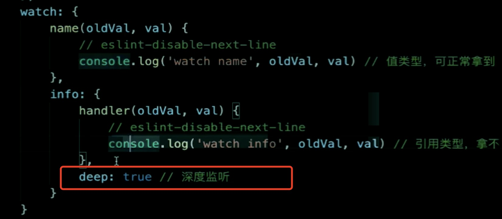
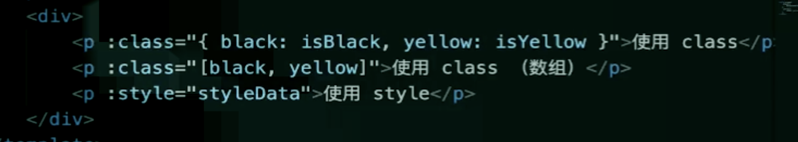
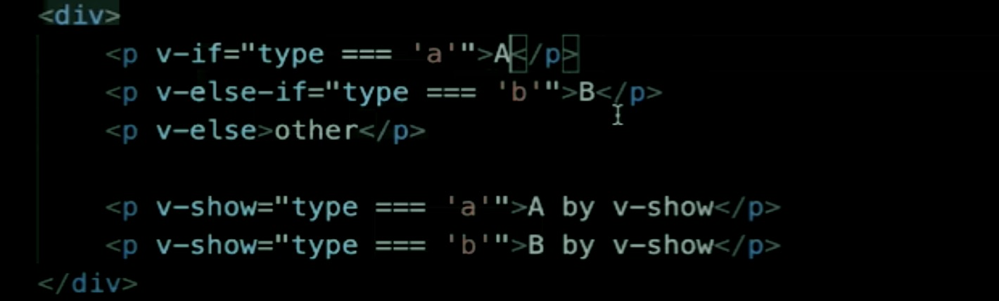

1. computed 和 watch

- computed 有缓存，data 不变则不会重新计算
- watch 如何深度监听？
  
- watch 监听引用类型，拿不到 oldValue

  2.class 和 style

* 使用动态属性
* 使用驼峰写法
  

3. v-if v-else 的用法

- 可使用变量，也可以使用 === 表达式
- v-if 和 v-show 的区别

  > v-if 不满足条件的不会渲染
  > v - show 不满足条件也会进行渲染，display：none 进行了隐藏

- v-if 和 v-show 的使用场景

  > 如果是频繁的切换操作选择使用 v-show 的性能会比较好，否则使用 v-if 的话会进行频繁的创建于销毁，消耗性能。

  

  4.循环列表渲染

- 如何遍历对象？—— 也可以用 v-for
- key 的重要性。key 不能乱写（如 random 或者 Index）
- v-for 和 v-if 不能一起使用
