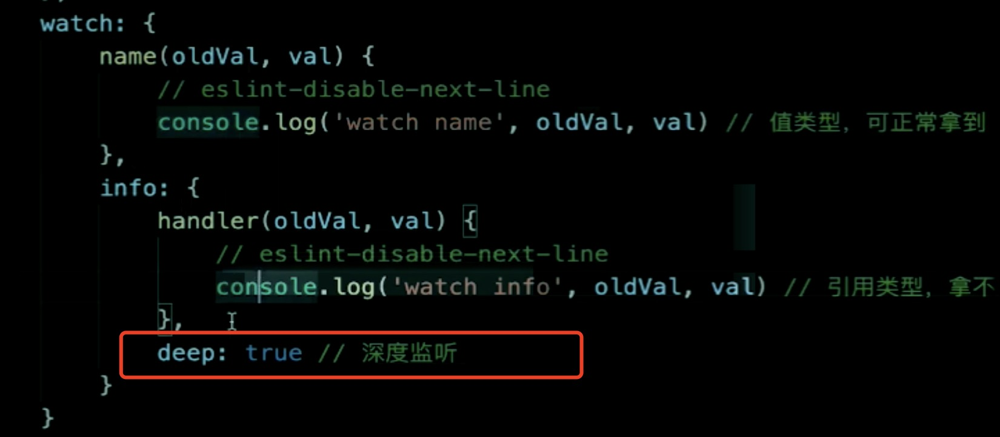
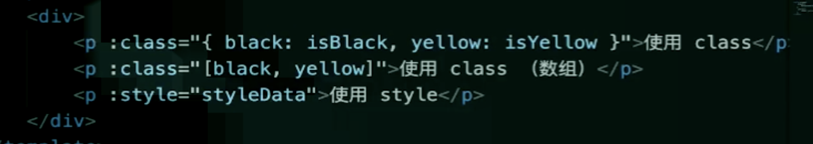
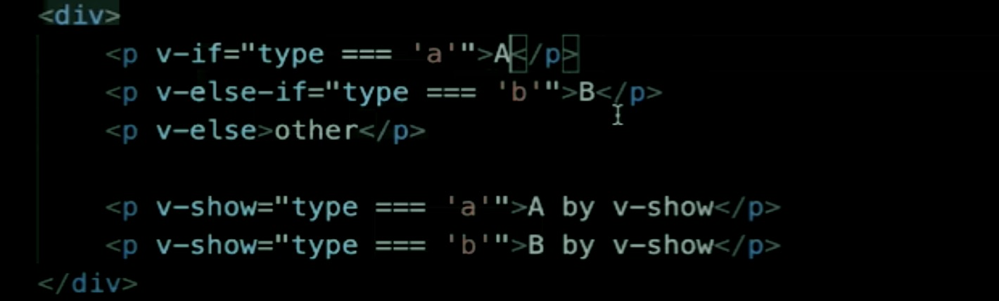
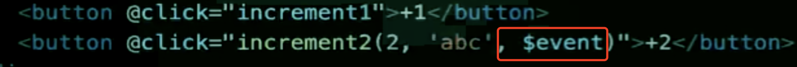
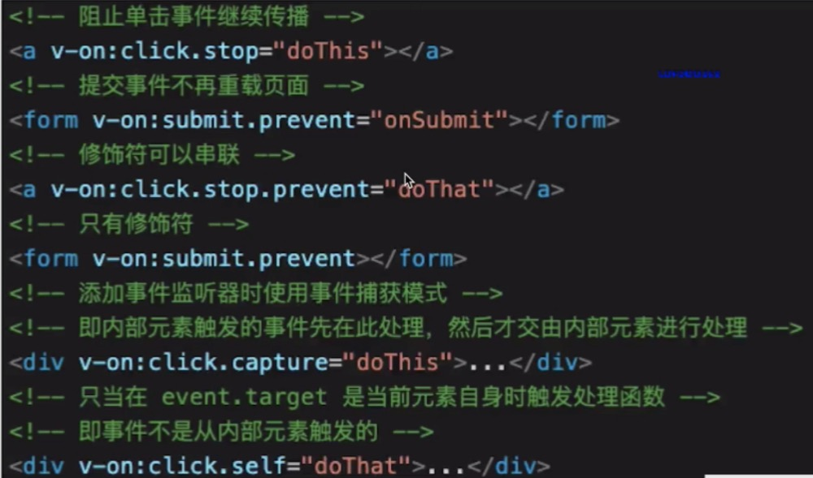
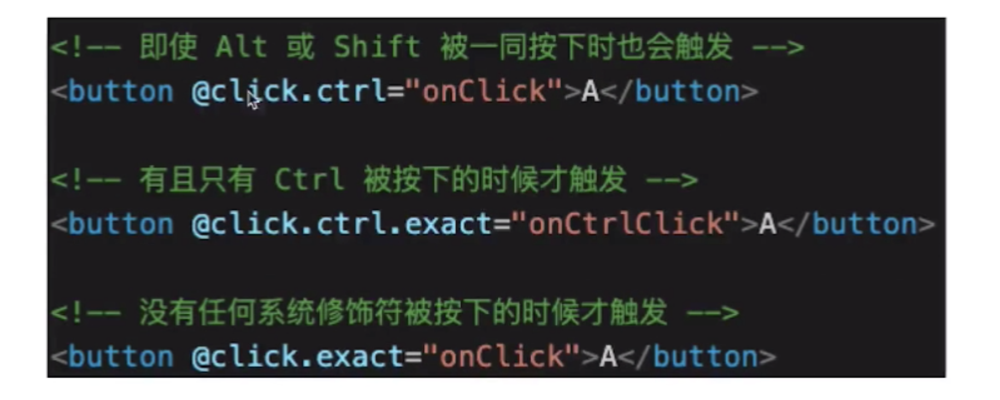

```
题目汇总：
computed 与 watch 的区别
watch 如何进行深度监听
watch 是否能够拿到 oldValue
class 和 style 的使用方法
v-if 与 v-show 的使用方法以及区别以使用场景
事件用法、常用的事件修饰符、Vue中事件是被绑定到哪里和react中的区别
关于循环列表渲染
表单双向绑定、常用表单、修饰符
```

---

1. computed 和 watch

- computed 有缓存，data 不变则不会重新计算
- watch 如何深度监听？
  
- watch 监听引用类型，拿不到 oldValue

2. class 和 style

- 使用动态属性
- 使用驼峰写法
  

3. v-if v-else 的用法

- 可使用变量，也可以使用 === 表达式
- v-if 和 v-show 的区别

  > v-if 不满足条件的不会渲染
  > v - show 不满足条件也会进行渲染，display：none 进行了隐藏

- v-if 和 v-show 的使用场景

  > 如果是频繁的切换操作选择使用 v-show 的性能会比较好，否则使用 v-if 的话会进行频繁的创建于销毁，消耗性能。

  

4. 循环列表渲染

- 如何遍历对象？—— 也可以用 v-for
- key 的重要性。key 不能乱写（如 random 或者 Index）
- v-for 和 v-if 不能一起使用

5. 事件

- event 参数，自定义参数

  > 若事件没有传递参数则默认参数为 event，若有自定义参数需要手动传递 event 参数，方法是传递\$event

  

- 【观察】事件被绑定到哪里？

  > 1. 这里的 event 就是原生的 event 对象没有经过任何装饰
  > 2. event.target 这个事件是在哪里监听的，事件被挂在到当前元素
  > 3. event.currentTarget 事件是在哪里触发的

- 事件修饰符，按键修饰符




6. 表单

- v-model
- 常见的表单项 textarea radio select checkbox
- 修饰符 lazy number trim
  > lazy 防抖的效果
  > number 输入数字
  > trim 去除前后的空格
