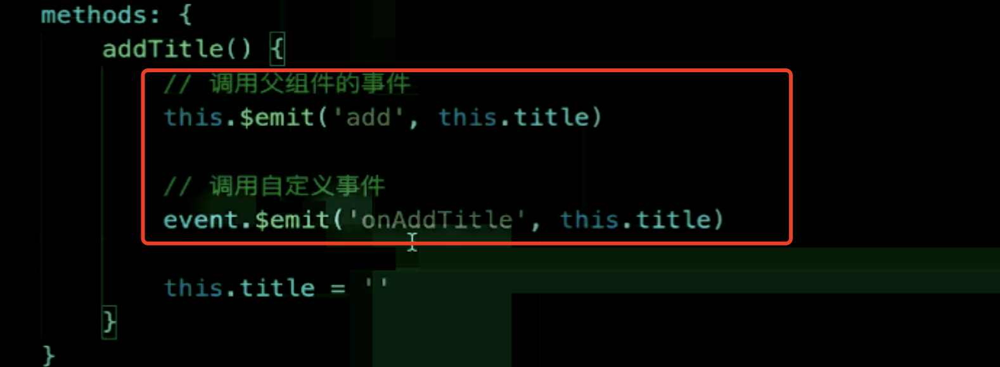

```
题目汇总：
props 与 $emit 用法
组件间的通讯
组件的生命周期
created 与 mounted 的区别
beforeDestroy 中经常采取一些什么操作
```

1. props 和 \$emit

> 父子组件之间通讯的一种方式

2. 组件通讯 - 自定义事件

> 兄弟组件之间通讯的方式



3. 组件生命周期

> 单个组件：挂载阶段 更新阶段 销毁阶段
> 挂载: beforeCreate created beforeMount mounted
> 更新: beforeUpdate updated
> 销毁: beforeDestroy destroyed

> 父子组件：created 是从外到内的，先父组件再子组件；mounted 是从内到外的先子组件渲染完父组件才能渲染完
> beforeUpdate 是从外到内的，先父组件再子组件；update 是从内到外的先子组件渲染完父组件才能渲染完
> beforeDestroy 是从外到内的，先父组件再子组件；destroyed 是从内到外的先子组件渲染完父组件才能渲染完

- created mounted 的区别

  > created 页面还没有开始渲染，但是 Vue 实例已经初始化了
  > mounted 页面已经渲染完了

- 在 beforeDestroy 这个生命周期里通常都要进行一些什么操作
  > 及时销毁自定义事件，否则可能造成内存泄漏
  > 销毁定时任务
