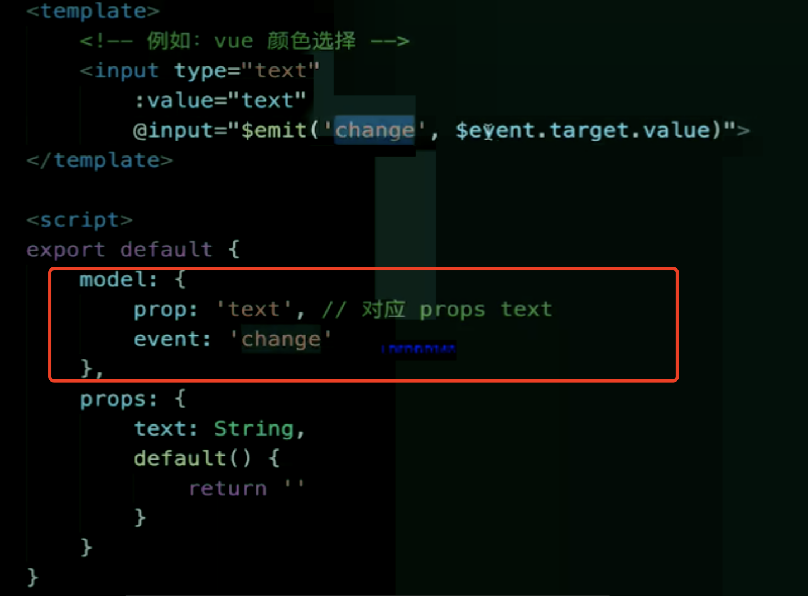
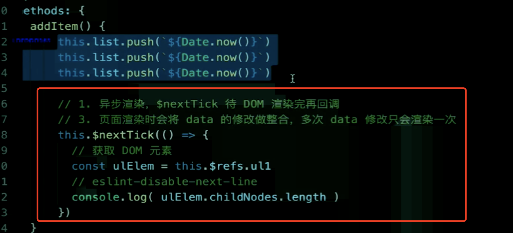
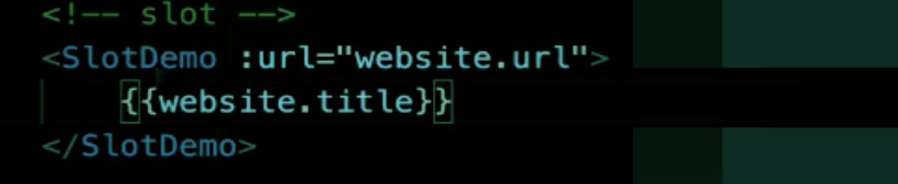
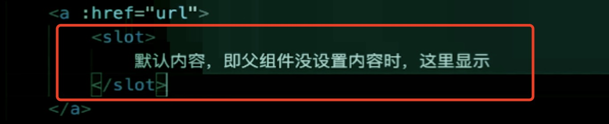
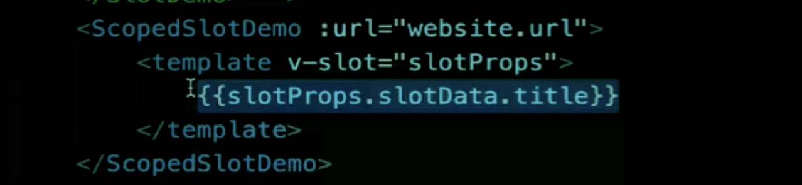
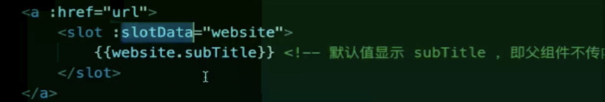
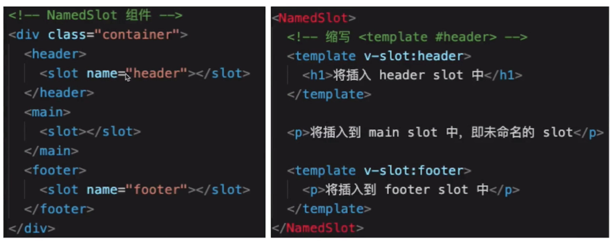

1. 自定义 v-model
  
  

2. \$nextTick

  > Vue 是异步渲染，data 改变后 DOM 不会立刻渲染，\$nextTick 会在 DOM 渲染之后被触发，以获取最新 DOM 节点

  

3. ref

```javascript
<ul ref="ul1"></ul>;
ulElemet = this.$refs.ul1; // 通过这个方法获取元素
```

4. slot
  > 简单来说就是父组件想要往子组件里去插入一段内容

> 基本使用：




> 作用域插槽 ：




> 具名 插槽 ：



5. 动态、异步组件
> 用法：:is= 'component-name';需要根据数据动态渲染的场景，即组件类型不确定

6. keep-alive
7. mixin
