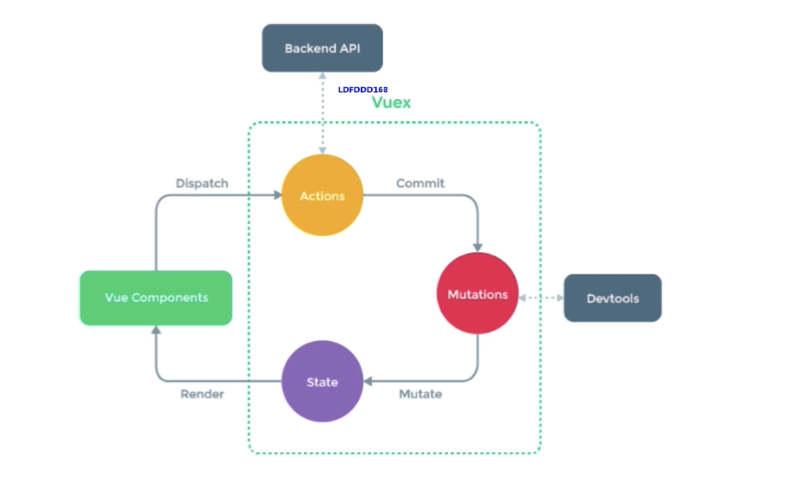
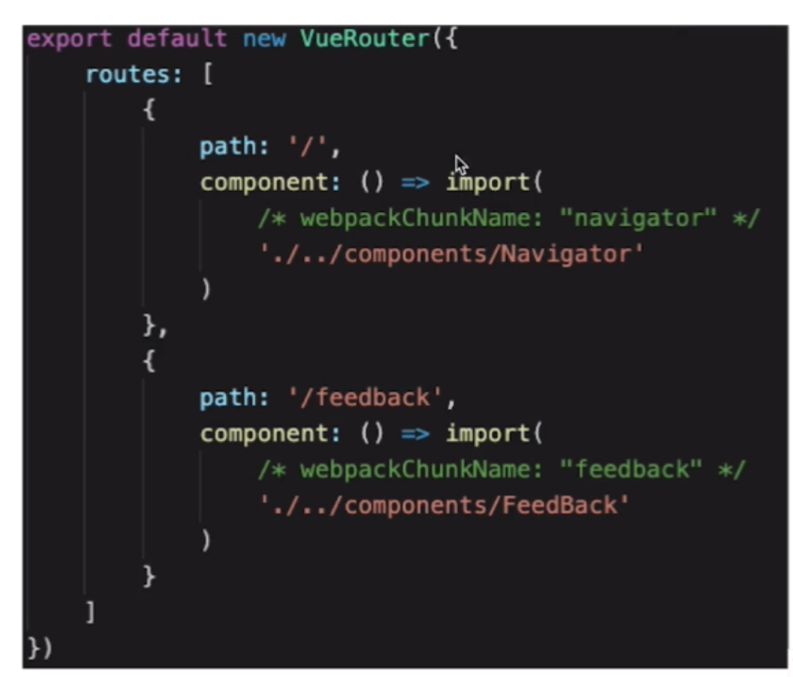

1. VueX

- 基本概念
  > state getter action mutation
  > dispatch commit mapState mapGetters mapActions mapMutations
  > actions 中进行异步操作
  > mutations 中进行同步操作

2. VueRouter

- 路由模式

  > hash、H5 history
  > 后者是需要 server 支持的，若无特殊需要可选择前者

- 路由配置

  > 动态路由、懒加载

