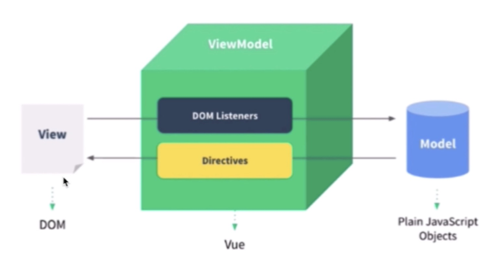

```
题目汇总：
如何理解 MVVM
Vue响应式
vdom与diff
为何在 v-for 中要使用 key
渲染过程 - 组件渲染和更新的过程
通用前端路由
```

————————

- 面试为何考察原理？
  知其然并知其所以然
  了解原理才能更好的应用

- 如何考察，以何种方式考察？
  考察重点而不是考察细节
  和使用相关
  整体流程是否全面？热门技术是否有深度？

- Vue 原理包括哪些？

  ————————

1. 组件化

- 组件化基础

  > 传统的组件，只是静态渲染，更新还要依赖于操作 DOM

- 如何理解 MVVM

  > 数据驱动视图
  > Vue - MVVM
  > React - setState
  > 使得开发更加专注于数据

  

  > view 视图 与 data Model 通过 viewModel 这 一层来做关联监听事件以及指令，在 model 修改后就能立即执行到 view 中渲染，view 中有任何事件监听的时候都可以去修改 model 中的数据。

2. 响应式

- 组件 data 的数据一旦变化，立刻触发视图的更新是如何实现的？

```JavaScript
// 核心 API ：Object.defineProperty

// 监听对象、数组
// 复杂对象、深度监听
// 触发更新视图
function updateView() {
    console.log('视图更新')
}

// 重新定义数组原型
const oldArrayProperty = Array.prototype
// 创建新对象，原型指向 oldArrayProperty ，再扩展新的方法不会影响原型
const arrProto = Object.create(oldArrayProperty);
['push', 'pop', 'shift', 'unshift', 'splice'].forEach(methodName => {
    arrProto[methodName] = function () {
        updateView() // 触发视图更新
        oldArrayProperty[methodName].call(this, ...arguments)
        // Array.prototype.push.call(this, ...arguments)
    }
})

// 重新定义属性，监听起来
function defineReactive(target, key, value) {
    // 深度监听
    observer(value)

    // 核心 API
    Object.defineProperty(target, key, {
        get() {
            return value
        },
        set(newValue) {
            if (newValue !== value) {
                // 深度监听
                observer(newValue)

                // 设置新值
                // 注意，value 一直在闭包中，此处设置完之后，再 get 时也是会获取最新的值
                value = newValue

                // 触发更新视图
                updateView()
            }
        }
    })
}

// 监听对象属性
function observer(target) {
    if (typeof target !== 'object' || target === null) {
        // 不是对象或数组
        return target
    }

    // 污染全局的 Array 原型
    // Array.prototype.push = function () {
    //     updateView()
    //     ...
    // }

    if (Array.isArray(target)) {
        target.__proto__ = arrProto
    }

    // 重新定义各个属性（for in 也可以遍历数组）
    for (let key in target) {
        defineReactive(target, key, target[key])
    }
}

// 准备数据
const data = {
    name: 'zhangsan',
    age: 20,
    info: {
        address: '北京' // 需要深度监听
    },
    nums: [10, 20, 30]
}

// 监听数据
observer(data)

// 测试
// data.name = 'lisi'
// data.age = 21
// // console.log('age', data.age)
// data.x = '100' // 新增属性，监听不到 —— 所以有 Vue.set
// delete data.name // 删除属性，监听不到 —— 所有已 Vue.delete
// data.info.address = '上海' // 深度监听
data.nums.push(4) // 监听数组


/* 几个缺点：
1. 深度监听需要递归到底，一次性计算量大
2. 无法监听新增/删除属性 - 使用Vue.set Vue.delete 来做到
3. 无法原生监听数组需要特殊处理
*/
```


- Vue3 使用 proxy 来解决这个问题
  
  > 存在的问题： 兼容性问题，且无法使用 polyfill

3. vdom 和 diff
   > 背景：DOM 操作非常的耗时，消耗性能，Vue 与 React 是数据驱动视图，如何有效的控制 DOM ？
   > vdom 存在的价值：数据驱动视图，控制 DOM 操作

- 用 JS 模拟 DOM 结构
  

- snabbdom (简洁强大的 vdom 库，易学易用，Vue 参考他实现的 vdom 和 diff)

  > 源码解读：
  > h 函数：h(tag,data,children) return vnode
  > vnode：最重要的几个属性 - select data children text element key
  > patch：patch(element,vnode) / patch(vnode,newVnode)
  > patch 函数：第一个参数不是 vnode 而是一个 dom 元素就创建一个空的 vnode 关联到 DOM 元素；相同的 vnode （sel「string 选择器 标签」 与 key 相同就判断他为相同）；不相同就销毁重建
  > patchVnode：vnode 做对比

- diff 算法 (vdom 中最核心最关键的部分)

  > 用 js 来模拟计算进行对比找出最小的更新范围进行更新，对比的过程就是 diff 算法

  > 树的 diff 算法时间复杂度为 O(n^3)
  > 优化到 O(n)：只比较同一层级不跨级比较；tag 不同，则直接删掉重建，不再深入比较；tag 和 key，两者都相同，则认为是相同的节点，不再深度比较


- 为何在 v-for 中要使用 key

  > 每个节点对应的唯一表示，可以更高效的找到对应的节点进行比较，不能使用 index 或者随机数当节点有了新的排序，使用 index 就很容易出现错误

- jiff (两个 JS 对象也可以做 diff 算法)

4. 模板编译

- 模板不是 HTML 有指令，插值，js 到底是什么？

  > 模板编译是编译成一个 render 函数，执行 render 函数返回 vnode，基于 vnode 执行 patch 和 diff，使用 webpack vue-loader 会在开发环境下编译模板(重要)

- js 的 with 语法
  > 改变{}内自由变量的查找规则，当做 obj 属性来查找
  > 如果找不到匹配的 obj 属性，则会报错
  > with 慎重使用，打破了作用域规则，易读性变差


- 使用 Vue 中的 render 代替 template


5. 渲染过程

- 组件渲染和更新的过程

  > 初次渲染过程：解析模板为 render 函数（或在开发环境已完成，vue-loader），触发响应式，监听 data 属性 getter setter，执行 render 函数(执行 render 会触发 getter)，生成 vnode，patch(elem,vnode)
  > 更新过程：修改 data 触发 setter（此前在 getter 中已被监听），重新执行 render 函数，生成 newVnode，再进行 patch 更新完成

  

  > 异步渲染：\$nextTick 汇总 data 的修改，一次性更新视图，减少 DOM 的操作次数提高性能

6.  通用的前端路由

- 路由模式

  > hash:
  > 特点 - hash 变化会触发页面跳转，即浏览器的前进后退，不会刷新页面 SPA 必须特点，hash 永远不会提交到 server 端，通过 window.onhashchange 来监听，可以通过设置 location.href 实现跳转
  > H5 history: 需要后端支持，用 URL 规范的路由，但跳转的时候不刷新页面，主要用 history.pushState 或者 window.onpopstate 实现
  > 两者选择：to B 的系统推荐用 hash，简单易用，对 URL 规范不敏感，to C 的系统，可以考虑选择 H5 history，但需要服务端支持，能简单就别用复杂的，考虑成本和收益

  

- 网页 URL 组成
  
