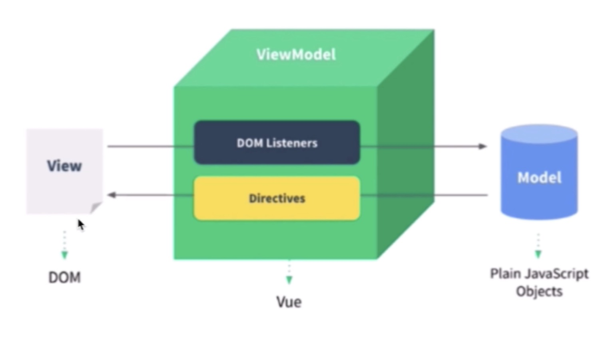
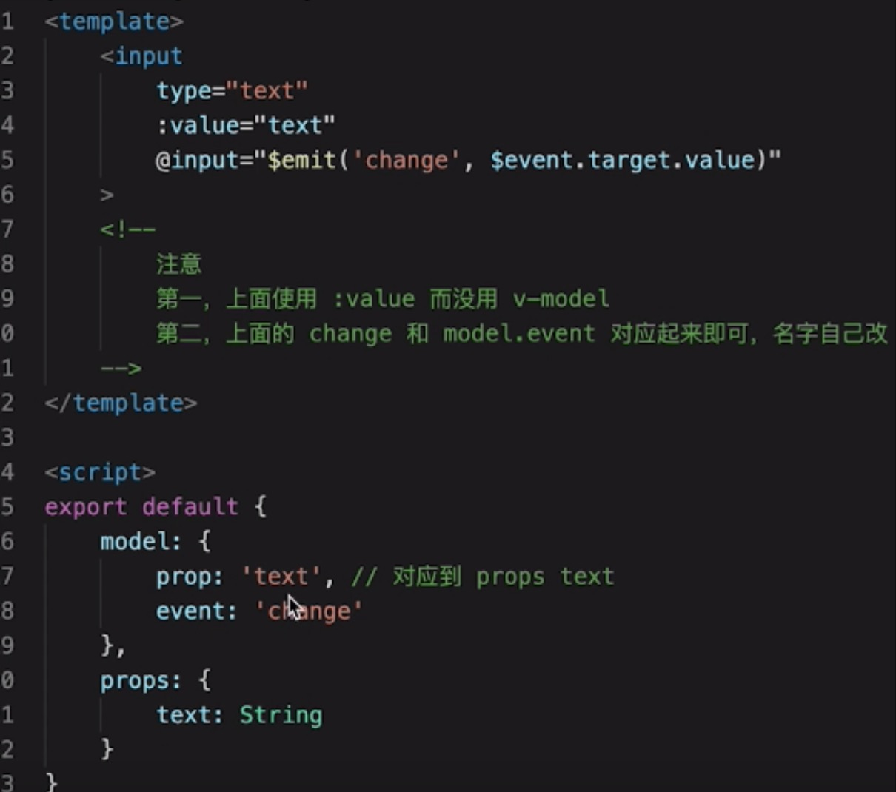

v-show 和 v-if 的区别
为何在 v-for 中用 key

- v-show 和 v-if 的区别

> v-show 通过 CSS display 控制显示和隐藏
> v-if 组件真正的渲染和销毁而不是显示和隐藏
> 频繁切换显示状态用 v-show，否则用 v-if

- 为何在 v-for 中用 key

  > 必须用 key ，且不能是 Index 和 random，diff 算法中通过 tag 和 key 来判断，是否是 sameNode，减少渲染次数，提升渲染性能

- 描述 Vue 组件生命周期 （父子组件）

- Vue 组件如何通讯

  > 父子组件 props 和 this.$emit 
  > 自定义事件 event.$on event.$off event.$emit
  > vuex

- 描述组件渲染和更新过程

  > 模板渲染 vdom-diff 响应式

- 双向数据绑定 v-model 的实现原理

  > input 元素的 value = this.name
  > 绑定 input 事件 this.name = \$event.target.value
  > data 更新触发 re-render

- 对 MVVM 的理解
  

  > view 视图 于 data Model 通过 viewModel 这 一层来做关联监听事件以及指令，在 model 修改后就能立即执行到 view 中渲染，view 中有任何事件监听的时候都可以去修改 model 中的数据。

- computed 有何特点

  > 缓存，data 不变不会重新计算，提高性能

- 为何组件 data 必须是一个函数

  > 每一个 Vue 组件都是一个 Vue 实例，通过 new Vue()实例化，引用同一个对象，如果 data 直接是一个对象的话，那么一旦修改其中一个组件的数据，其他数组相同数据就会被改变，而 data 是函数的话，每个 Vue 组件有了自己的作用域，互不干扰

- ajax 请求应该放在哪个生命周期

  > 放在 mounted 中 ，也就是说在 dom 渲染完成之后，触发 ajax 请求，因为 js 是单线程的，ajax 异步获取数据，放在 mounted 之前没有用，只要 js 没有渲染完，ajax 处于异步排列过程中，也在等待，放在 mounted 之前只会让逻辑变得更加混乱

- 如何将组件所有 props 传递给子组件

  > $props  <User v-bind='$props'>

- 如何自己实现 v-model
  > 定义一个 props， 在 model 中吧 props 写上 event 定义为 change，然后用 input 事件去触发 change，把 value 写上

- 多个组件有相同的逻辑，如何抽离？

  > 使用 mixin

- 何时使用异步组件

  > 加载大组件、路由异步加载

- 何时需要使用 keep-alive

  > 缓存组件，不需要重复渲染；如多个静态 tab 页的切换；性能优化

- 何时需要使用 beforeDestroy

  > 解绑自定义事件 event.\$off
  > 清楚定时器
  > 解绑自定义的 DOM 事件，如 window scroll 等

- 什么是作用域插槽

- Vuex 中 action 和 mutation 有何区别

  > action 中处理异步，mutation 不可以
  > mutation 做原子操作
  > action 可以整合多个 mutation

- Vue-router 常用的路由模式

  > hash 默认
  > H5 history

- 如何配置 Vue-router 异步加载

  > import 异步组件的方式

- 用 vnode 描述一个 DOM 结构

  > 就是用 js 模拟一个 DOM 结构

- 监听 data 变化的核心 API 是什么，以及深度监听、监听数组，有何缺点

  > Object.defineProperty

- Vue 如何监听数组变化

  > Object.defineProperty 不能监听数组变化，重新定义原型，重写 push pop 等方法，实现监听，Proxy 可以原生监听数组变化

- 请描述响应式原理

  > 监听 data 变化 + 组件渲染和更新的流程

- diff 算法的时间的复杂度

  > O(n),在 O(n^3) 基础上做了一些调整
  > 树的 diff 算法时间复杂度为 O(n^3)
  > 优化到 O(n)：只比较同一层级不跨级比较；tag 不同，则直接删掉重建，不再深入比较；tag 和 key，两者都相同，则认为是相同的节点，不再深度比较

- 简述 diff 算法过程

  > patch(elem,vnode) patch(vnode,newVnode)
  > patchVnode 和 addVnodes 和 removeVnodes
  > updateChildren

- Vue 为何是异步渲染，\$nextTick 何用？

  > 异步渲染（以及合并 data 修改），以提高渲染性能，\$nextTick 在 DOM 更新完之后触发回调

- Vue 常见性能优化
  > 合理使用 v-show 和 v-if
  > 合理使用 computed
  > v-for 时加 key,以及避免和 v-if 同时使用
  > 自定义事件、DOM 事件及时销毁
  > 合理使用异步组件
  > 合理使用 keep-alive
  > data 层级不要太深，否则递归调用会很消耗性能
  > 使用 vue-loader 在开发环境做模板编译
  > webpack 层面的优化（...）
  > 前端通用的性能优化，如图片懒加载（...）
  > 使用 SSR（...）
