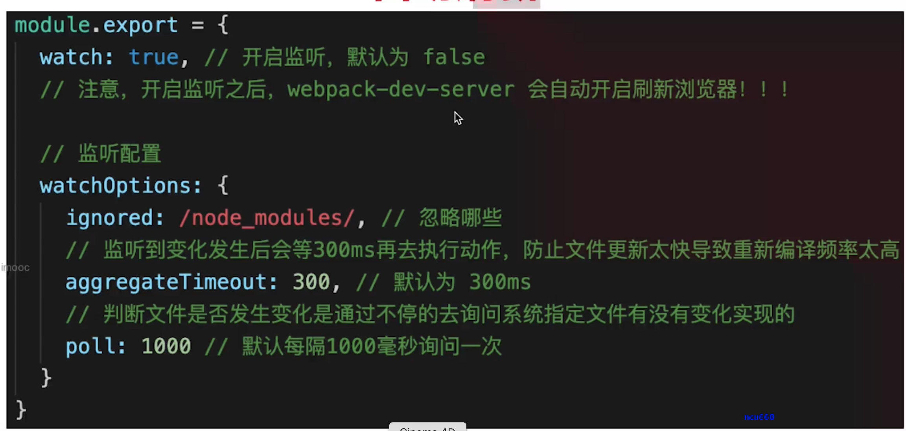

- 优化打包构建速度 - 开发体验和效率

> 优化 babel-loader:
> 缓存 明确范围


> IgnorePlugin: 避免一些模块引用

```js
plugins: [new webpack.IgnorePlugin(/\.\/locale/, /moment/)];
```

> noPrase: 避免打包一些东西

> happyPack: 多进程打包
> JS 单线程，开启多进程打包，提高构建速度(特别是多核 CPU)

```js
const HappyPack = require('happypack');

module: {
  rules: [
    // js
    {
      test: /\.js$/,
      // 把对 .js 文件的处理转交给 id 为 babel 的 HappyPack 实例
      use: ['happypack/loader?id=babel'],
      include: srcPath,
      // exclude: /node_modules/
    },
  ];
}

plugins: [
  // happyPack 开启多进程打包
  new HappyPack({
    // 用唯一的标识符 id 来代表当前的 HappyPack 是用来处理一类特定的文件
    id: 'babel',
    // 如何处理 .js 文件，用法和 Loader 配置中一样
    loaders: ['babel-loader?cacheDirectory'],
  }),
];
```

> ParallelUglifyPlugin: 多进程压缩 js
> webpack 内置 Uglify 工具压缩 JS；JS 单线程，开启多进程压缩更快；和 happyPack 同理

```js
// prod 下
const ParallelUglifyPlugin = require('webpack-parallel-uglify-plugin');

plugins: [
  // 使用 ParallelUglifyPlugin 并行压缩输出的 JS 代码
  new ParallelUglifyPlugin({
    // 传递给 UglifyJS 的参数
    // （还是使用 UglifyJS 压缩，只不过帮助开启了多进程）
    uglifyJS: {
      output: {
        beautify: false, // 最紧凑的输出
        comments: false, // 删除所有的注释
      },
      compress: {
        // 删除所有的 `console` 语句，可以兼容ie浏览器
        drop_console: true,
        // 内嵌定义了但是只用到一次的变量
        collapse_vars: true,
        // 提取出出现多次但是没有定义成变量去引用的静态值
        reduce_vars: true,
      },
    },
  }),
];
```

> 自动刷新:整个网页全部刷新，速度较慢；真个网页全部刷新，状态会丢失； （不用于生产环境）
> 

> 热更新:新代码生效，网页不刷新，状态不丢失（不用于生产环境）

```js
// dev 下
const HotModuleReplacementPlugin = require('webpack/lib/HotModuleReplacementPlugin');

 entry: {
        index: [
            'webpack-dev-server/client?http://localhost:8080/',
            'webpack/hot/dev-server',
            path.join(srcPath, 'index.js')
        ],
    },

/* Index.js */
// 增加，开启热更新之后的代码逻辑
if (module.hot) {
    module.hot.accept(['./math'], () => {
        const sumRes = sum(10, 30)
        console.log('sumRes in hot', sumRes)
    })
}

```

> DllPlugin: 动态链接库插件（不用于生产环境）
> webpack 已经内置 DLLPlugin 支持
> 包含： DllPlugin - 打包出 dll 文件；DllReferencePlugin - 使用 dll 文件

- 优化产出代码 - 产品性能

  > 体积更小；合理分包，不重复加载；速度更快，内存使用更少

  > 小图片 base64 编码

  > bundle 加 hash

  > 懒加载

  > 提取公共代码

  > IgnorePlugin

  > 使用 CDN 加速

  ```js
  output: {
    publicPath: 'http://cdn.abc.com'  // 修改所有静态文件 url 的前缀（如 cdn 域名），这里暂时用不到
    },
  ```

  > 使用 production
  > mode:production 自动开启代码压缩
  > Vue React 等会自动删掉调试代码（如开发环境的 warning）
  > 启动 Tree-Shaking: 用不到的就不打包了

  > 使用 scope hosting
  > 有点：代码体积更小、创建函数作用域更少、代码可读性更好


- ES6 Module 和 Commonjs 的区别

  > ES6 Module 静态引入，编译时引入
  > Commonjs 动态引入，执行时引入
  > 只有 ES6Module 才能静态分析，实现 Tree-Shaking


