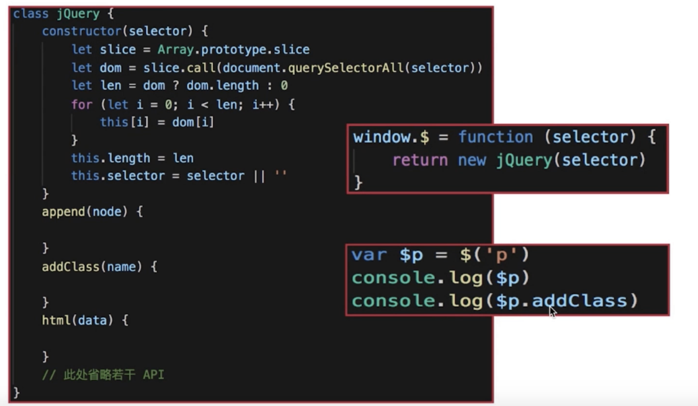

- 搭建开发环境

  > 初始化 npm 环境
  > webpack
  > webpack-dev-server
  > babel

- 什么是面向对象

  > 类，即模板，包括：属性，方法
  > 对象（实例）

- 面向对象三要素

  > 继承 封装 多态
  > 继承：子类继承父类
  > People 是父类，公共的，不仅仅服务于 Student
  > 继承可将公共方法抽离出来，提高复用，减少冗余

  > 封装：数据的权限和保密
  > public 完全开放 private 对自己开放 protected 对子类开放
  > 减少耦合，不该外露的不外露
  > 利于数据、接口的权限管理
  > ES6 目前不支持，一般认为 \_开头的属性是 private

  > 多态：统一接口不同实现
  > 同一个接口不同表现
  > JS 应用极少 了解就行
  > 需要结合 Java 等语言的接口、重写、重载等功能
  > 保持子类的开放性和灵活性
  > 面向接口编程

* JS 面向对象应用举例

  > JQuery 是一个 class
  > \$('div') 就是 JQuery 的一个实例

- 面向对象的意义，为何使用面向对象
  > 程序执行：顺序、判断、循环 —— 结构化
  > 面向对象 —— 数据结构化
  > 对于计算机，结构化的才是最简单的
  > 编程应该简单、抽象

