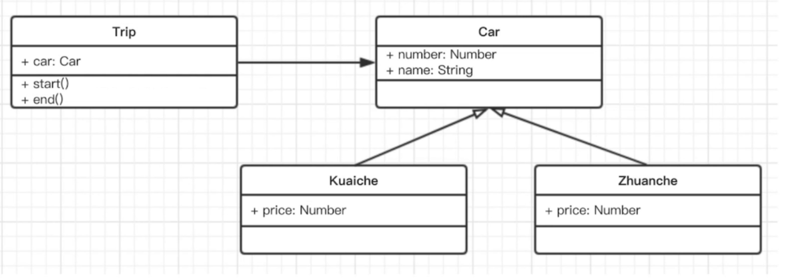
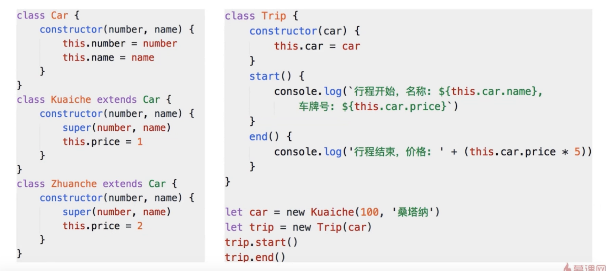
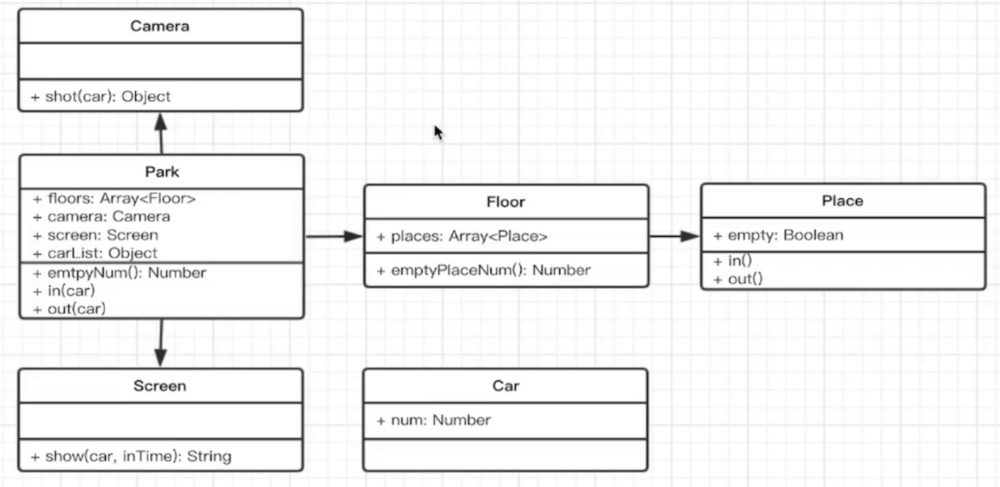

- 某打车软件公司一面：打车时，可以打专车或者快车，任何车都有车牌号和名称，不通车价格不同，快车每公里 1 元，专车每公里 2 元，行程开始时，显示车辆信息，行程结束时，显示打车金额（假定行程就 5 公里）。

画出 UML 类图，用 ES6 语法写出该示例。



- 某短视频公司二面：某停车场，分 3 层，每层 100 车位，每个车位都能监控到车辆的驶入和离开，车辆进入前，显示每层的空余车位数量，车辆进入时，摄像头可识别车牌号和时间，车辆出来时，出口显示器显示车牌号和停车时长

画出 UML 类图


```js
// 车
class Car {
  constructor(num) {
    this.num = num;
  }
}

// 入口摄像头
class Camera {
  shot(car) {
    return {
      num: car.num,
      inTime: Date.now(),
    };
  }
}

// 出口显示器
class Screen {
  show(car, inTime) {
    console.log('车牌号', car.num);
    console.log('停车时间', Date.now() - inTime);
  }
}

// 停车场
class Park {
  constructor(floors) {
    this.floors = floors || [];
    this.camera = new Camera();
    this.screen = new Screen();
    this.carList = {};
  }
  in(car) {
    // 获取摄像头的信息：号码 时间
    const info = this.camera.shot(car);
    // 停到某个车位
    const i = parseInt((Math.random() * 100) % 100);
    const place = this.floors[0].places[i];
    place.in();
    info.place = place;
    // 记录信息
    this.carList[car.num] = info;
  }
  out(car) {
    // 获取信息
    const info = this.carList[car.num];
    const place = info.place;
    place.out();

    // 显示时间
    this.screen.show(car, info.inTime);

    // 删除信息存储
    delete this.carList[car.num];
  }
  emptyNum() {
    return this.floors
      .map((floor) => {
        return `${floor.index} 层还有 ${floor.emptyPlaceNum()} 个车位`;
      })
      .join('\n');
  }
}

// 层
class Floor {
  constructor(index, places) {
    this.index = index;
    this.places = places || [];
  }
  emptyPlaceNum() {
    let num = 0;
    this.places.forEach((p) => {
      if (p.empty) {
        num = num + 1;
      }
    });
    return num;
  }
}

// 车位
class Place {
  constructor() {
    this.empty = true;
  }
  in() {
    this.empty = false;
  }
  out() {
    this.empty = true;
  }
}

// 测试代码------------------------------
// 初始化停车场
const floors = [];
for (let i = 0; i < 3; i++) {
  const places = [];
  for (let j = 0; j < 100; j++) {
    places[j] = new Place();
  }
  floors[i] = new Floor(i + 1, places);
}
const park = new Park(floors);

// 初始化车辆
const car1 = new Car('A1');
const car2 = new Car('A2');
const car3 = new Car('A3');

console.log('第一辆车进入');
console.log(park.emptyNum());
park.in(car1);
console.log('第二辆车进入');
console.log(park.emptyNum());
park.in(car2);
console.log('第一辆车离开');
park.out(car1);
console.log('第二辆车离开');
park.out(car2);

console.log('第三辆车进入');
console.log(park.emptyNum());
park.in(car3);
console.log('第三辆车离开');
park.out(car3);
```
