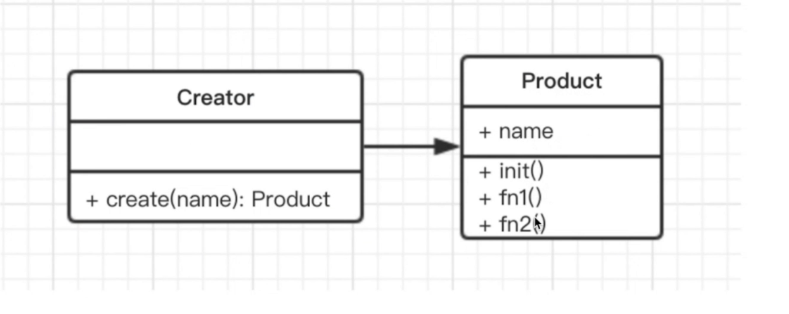

- 介绍
  > 将 new 操作单独封装，遇到 new 时，就要考虑是否该使用工厂模式
  > 举例：去购买汉堡，直接点餐、取餐，不会自己亲手做，商店要封装做汉堡的工作，做好直接给买者



```js

Class Product  {
  constructor(name) {
    this.name = name
  }

  init() {}

  fun1(){}
}

Class Creator{
  create(name) {
    return new Product(name)
  }
}

let creator = new Creator()
let p = creator.create('p1')

```

- 使用场景

  > JQuery \$('')
  > React.createElement
  > Vue 异步组件

- 设计原则验证
  > 构造函数和创建者分离
  > 符合开放封闭原则
