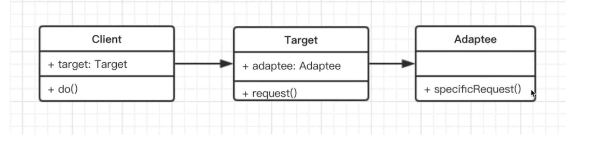

> 旧接口格式和使用者不兼容
> 中间加一个适配器转换接口



```js
class Adaptee {
  specificRequest() {
    return '德国标准插头';
  }
}

class Target {
  constructor() {
    this.adaptee = new Adaptee();
  }

  request() {
    let info = this.adaptee.specificRequest();
    return `${info} - 转换器 - 中国标准插头`;
  }
}

let target = new Target();
let res = target.request();
console.log(res);
```

- 使用场景
  > 封装旧接口
  > Vue Computed
