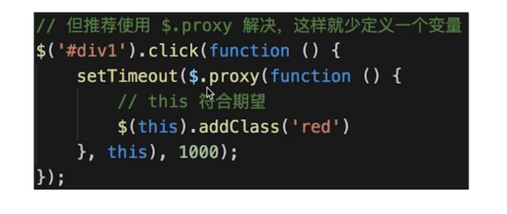

> 使用者无权访问目标对象
> 中间加代理，通过代理做授权和控制


- 示例

  > 科学上网 明星经纪人

- 使用场景
  > 网页事件代理
  > 

> JQuery \$.proxy
>  > 

> ES6 Proxy

```js
// 明星
let star = {
  name: '张XX',
  age: 25,
  phone: '13910733521',
};

// 经纪人
let agent = new Proxy(star, {
  get: function (target, key) {
    if (key === 'phone') {
      // 返回经纪人自己的手机号
      return '18611112222';
    }
    if (key === 'price') {
      // 明星不报价，经纪人报价
      return 120000;
    }
    return target[key];
  },
  set: function (target, key, val) {
    if (key === 'customPrice') {
      if (val < 100000) {
        // 最低 10w
        throw new Error('价格太低');
      } else {
        target[key] = val;
        return true;
      }
    }
  },
});

// 主办方
console.log(agent.name);
console.log(agent.age);
console.log(agent.phone);
console.log(agent.price);

// 想自己提供报价（砍价，或者高价争抢）
agent.customPrice = 150000;
// agent.customPrice = 90000  // 报错：价格太低
console.log('customPrice', agent.customPrice);
```

- 设计原则验证

  > 代理类和目标类分离，隔离开目标类和使用者
  > 符合 O

- 代理模式 vs 适配器模式

  > 代理：提供一模一样的接口
  > 适配器：提供一个不同的接口

- 代理模式 vs 装饰器模式
  > 显示原有功能，但是经过限制和阉割后的
  > 装饰器：扩展功能，原有功能不变且可直接使用
