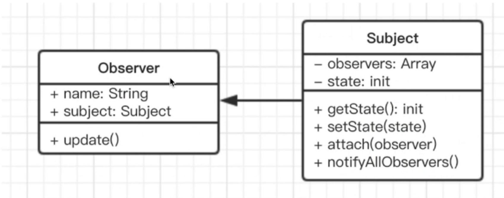
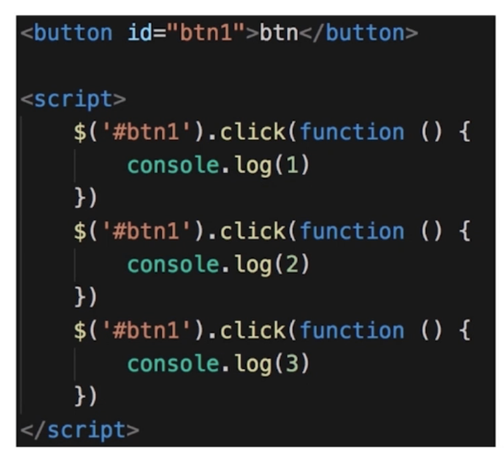
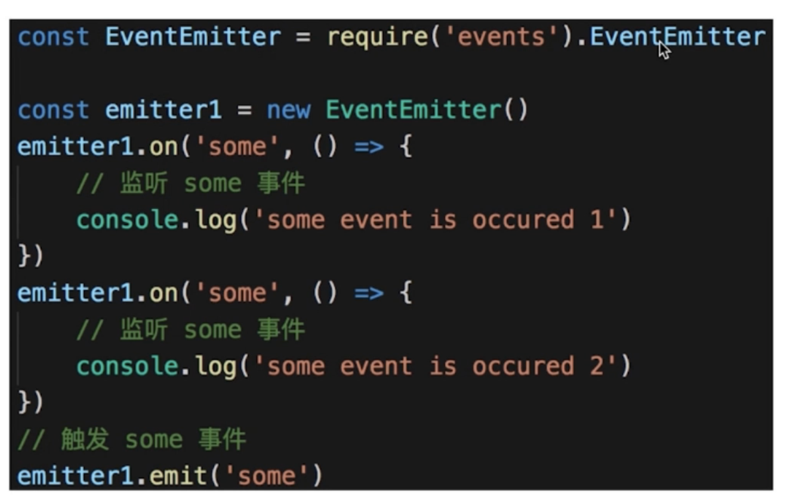
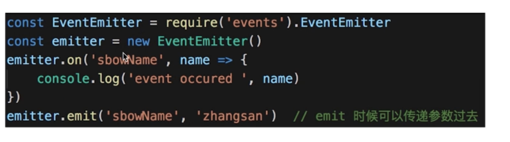
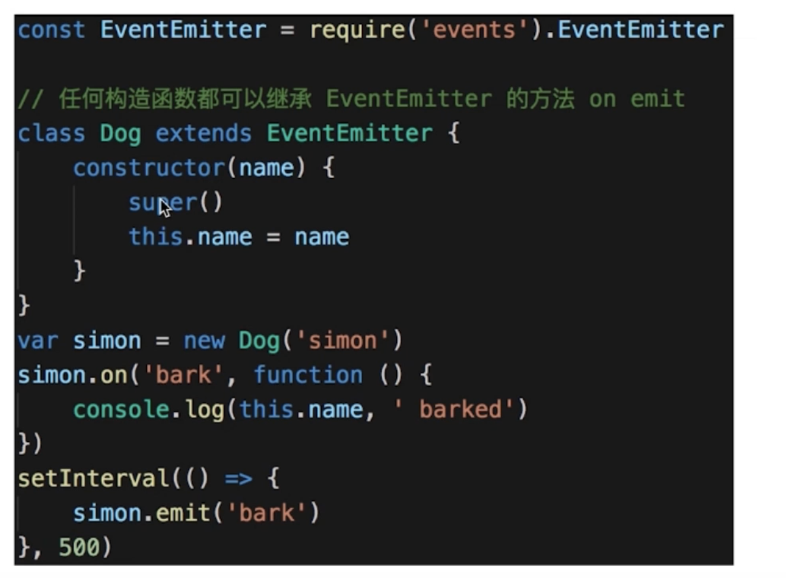
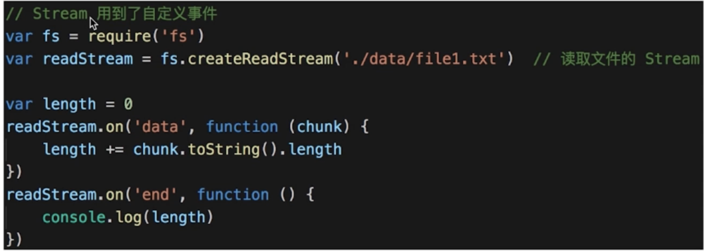
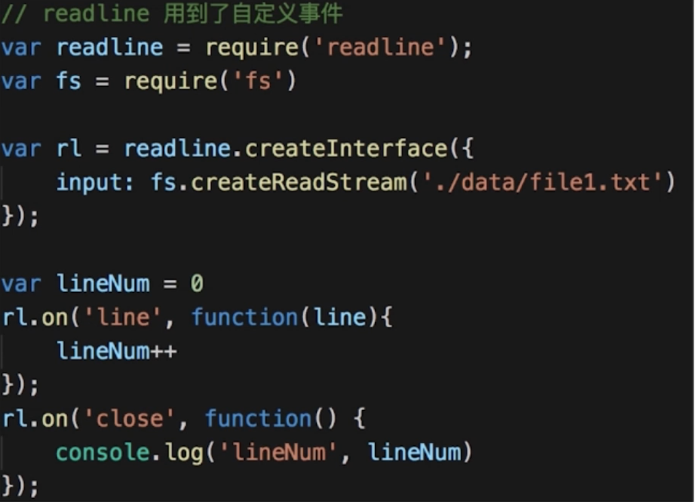

> 发布 & 订阅
> 一对多



```js
// 主题，接收状态变化，触发每个观察者
class Subject {
  constructor() {
    this.state = 0;
    this.observers = [];
  }
  getState() {
    return this.state;
  }
  setState(state) {
    this.state = state;
    this.notifyAllObservers();
  }
  attach(observer) {
    this.observers.push(observer);
  }
  notifyAllObservers() {
    this.observers.forEach((observer) => {
      observer.update();
    });
  }
}

// 观察者，等待被触发
class Observer {
  constructor(name, subject) {
    this.name = name;
    this.subject = subject;
    this.subject.attach(this);
  }
  update() {
    console.log(`${this.name} update, state: ${this.subject.getState()}`);
  }
}

// 测试代码
let s = new Subject();
let o1 = new Observer('o1', s);
let o2 = new Observer('o2', s);
let o3 = new Observer('o3', s);

s.setState(1);
s.setState(2);
s.setState(3);
```

- 示例

  > 点咖啡，在座位上坐着等就行

- 使用场景

  > 网页事件绑定

  

  > Promise

> JQuery callbacks


> nodejs 自定义事件








> nodejs 中处理 HTTP 请求；多进程通讯
> Vue React 组件生命周期触发
> Vue watch

- 设计原则验证
  > 符合 S O
