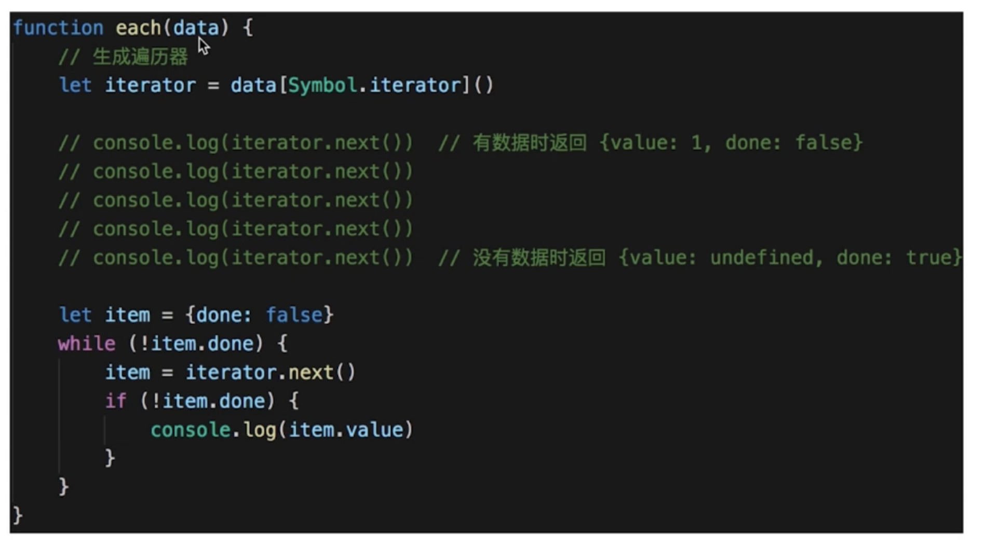

> 顺序访问一个集合
> 使用者无需知道集合的内部结构（封装）


```js
class Iterator {
  constructor(conatiner) {
    this.list = conatiner.list;
    this.index = 0;
  }
  next() {
    if (this.hasNext()) {
      return this.list[this.index++];
    }
    return null;
  }
  hasNext() {
    if (this.index >= this.list.length) {
      return false;
    }
    return true;
  }
}

class Container {
  constructor(list) {
    this.list = list;
  }
  getIterator() {
    return new Iterator(this);
  }
}

// 测试代码
let container = new Container([1, 2, 3, 4, 5]);
let iterator = container.getIterator();
while (iterator.hasNext()) {
  console.log(iterator.next());
}
```

- 使用场景
  > JQuery each
  > ES6 Iterator

> ES6 Iterator 为何存在?
> 有序集合的数据类型已经有很多
> Array Map Set String TypedArray arguments NodeList
> 需要有一个统一的遍历接口来遍历所有的数据类型

> ES6 Iterator 是什么?
> 以上数据类型，都有 [Symbol.iterator] 属性
> 属性值是函数，执行函数返回一个迭代器
> 迭代器就有 next 方法可顺序迭代子元素
> 可运行 Array.prototype[Symbol.iterator] 来测试
> 新语法使用 for of 是遍历迭代器的



- Iterator 与 Generator

  > Generator 也实现了 Iterator

- 设计原则验证
  > 符合 S O
