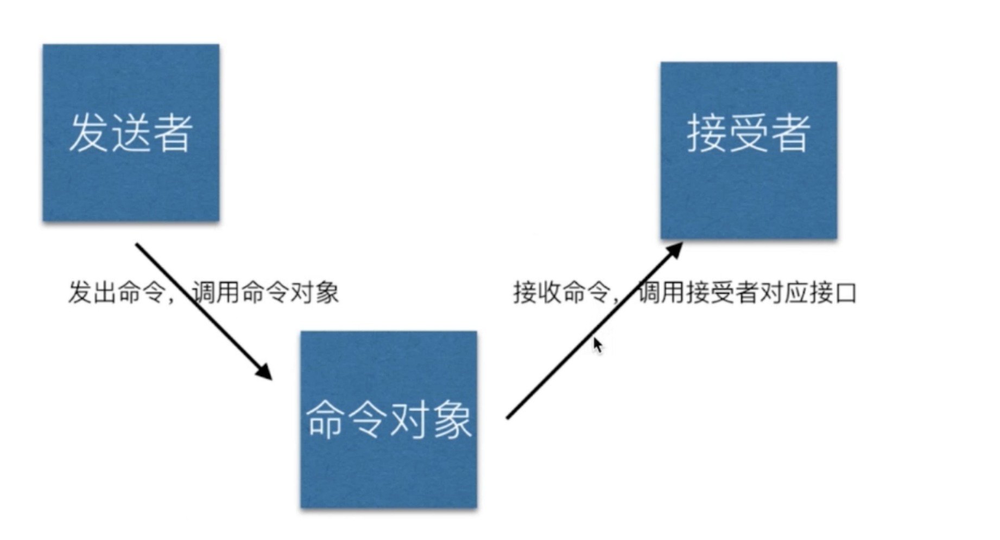

- 原型模式

  > clone 自己，生成一个新对象，new 一个对象开销比较到，所有复制一个自己来实现

- 应用

  > Object.create

  ***

- 桥接模式

  > 用于把抽象化以实现化解耦，使得二者可以独立变化

- 应用
  

---

- 组合模式

  > 生成树形结构，表示 整体 - 部分 关系
  > 让整体和部分都具有一致的操作方式,整体和单个节点的数据结构也是一样的

* 应用
  > 虚拟 DOM 中的 vnode 是这种形式，但数据类型简单

---

- 享元模式
  > 享元内存（主要考虑内存，而非效率）
  > 相同的数据共享使用

---

- 策略模式
  > 不同策略分开处理
  > 避免出现大量 if else 或者 switch case

---

- 模板模式

---

- 职责链模式

  > 一部操作可能分为多个职责角色来完成
  > 把这些角色都分开，然后用一个链串起来
  > 将发起者和各个处理者进行隔离

- 应用场景如请假
  

  > 联想到 JS 中的链式操作

---

- 命令模式
  > 执行命令时，发布者和执行者分开
  > 中间加入命令对象，作为中转站

- js 中的应用
  > 网页富文本编辑器操作，浏览器封装了一个命令对象
  > document.execCommand('bold')
  > document.execCommand('undo')

---

- 备忘录模式
  > 随时记录一个对象的状态变化，随时可以恢复之前的某个状态，如撤销功能

---

- 中介者模式
  
  

---

- 访问者模式
  > 将数据操作和数据结构进行分离

---

- 解释器模式
  > 描述语言语法如何定义，如何解释和编译
