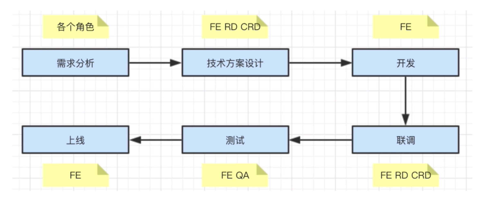

- 为何考察项目流程

  > 确定你真正参与过实际项目
  > 确定你能真正解决项目的问题
  > 看你能否独立承担起一个项目

  ***

* 项目分多人，多角色参与

  > PM 产品经理
  > UE 视觉设计师
  > FE 前端开发
  > RD 后端开发
  > CRD 移动端开发
  > QA 测试人员

* 项目分多阶段

- 项目需要计划和执行

  > stage1 需求分析：了解背景 -> 质疑需求是否合理 -> 需求是否闭环 -> 发开难度如何 -> 是否需要其他支持 -> 不要急于排期

  > stage2 技术方案设计：求简，不过度设计 -> 产出文档 -> 找准设计重点 -> 组内评审 -> 和 RE CRD 沟通 -> 发送会议结论

  > stage3 开发：如何反馈排期- 预留时间/考虑开发依赖 -> 符合开发规范 -> 写出开发文档 -> 及时单元测试 -> mock API -> code review

  > stage4 联调：和 RD CRD 技术链条 -> 让 UE 确定视觉效果 -> 让 PM 确定产品功能

  > stage5 测试：提测发邮件，抄送项目组 -> 测试问题要详细记录 -> 有问题及时沟通，QA 和 FE 天生信息不对称 -> 当面讨论问题，让 QA 帮你复现

  > stage6 上线：上线之后及时通知 QA 回归测试 -> 上线之后及时同步给 PM 和项目组 -> 如果有问题及时回滚，先止损再排查问题

---

- PM 想在项目开发过程中增加需求，该怎么办

> 不能拒绝，走需求变更流程即可，发起项目组和 leader 的评审，重新评估排期

- 项目即将延期了，该怎么办

  > 

- 你将如何保证项目质量

  > 符合开发规范，写好开发文档，及时单元测试，及时 code review 一下

- 如何讲解
  > 项目的所有角色
  > 项目的全流程
  > 各个阶段中的常见问题
